# Redis 相关命令


## 关于安装

### Redis安装

Redis是基于C语言编写的，因此首先需要安装Redis所需要的gcc依赖：

```bash
yum install -y gcc tcl
```

解压缩：

压缩在 `/usr/local/src`下

```bash
tar -xzf redis-6.2.6.tar.gz
```

解压后：

进入redis目录：

```bash
cd redis-6.2.6
```

运行编译命令：

```bash
make && make install
```

如果没有出错，应该就安装成功了。

默认的安装路径是在 `/usr/local/bin`目录下：

该目录以及默认配置到环境变量，因此可以在任意目录下运行这些命令。其中：

- redis-cli：是redis提供的命令行客户端
- redis-server：是redis的服务端启动脚本
- redis-sentinel：是redis的哨兵启动脚本

---

**如果没有任意目录下启动**

修改profile文件：

```bash
vi /etc/profile 
```


在最后行添加:

```bash
export PATH=$PATH:/usr/local/bin
```

注意：/usr/local/bin表示的是redis-server 命令存在的目录路径

重新加载/etc/profile

```bash
source /etc/profile  
```


在任意目录执行命令

```bash
redis-server 
```


---

### **Redis配置文件**

我们先将这个配置文件备份一份：

```bash
cp redis.conf redis.conf.bck
```


然后修改redis.conf文件中的一些配置：

```properties
# 允许访问的地址，默认是127.0.0.1，会导致只能在本地访问。修改为0.0.0.0则可以在任意IP访问，生产环境不要设置为0.0.0.0
bind 0.0.0.0
# 守护进程，修改为yes后即可后台运行
daemonize yes 
# 密码，设置后访问Redis必须输入密码
requirepass 123321
```


Redis的其它常见配置：

```properties
# 监听的端口
port 6379
# 工作目录，默认是当前目录，也就是运行redis-server时的命令，日志、持久化等文件会保存在这个目录
dir .
# 数据库数量，设置为1，代表只使用1个库，默认有16个库，编号0~15
databases 1
# 设置redis能够使用的最大内存
maxmemory 512mb
# 日志文件，默认为空，不记录日志，可以指定日志文件名
logfile "redis.log"
```


启动Redis：

```sh
# 进入redis安装目录 
cd /usr/local/src/redis-6.2.6
# 启动
redis-server redis.conf
```


停止服务：

```sh
# 利用redis-cli来执行 shutdown 命令，即可停止 Redis 服务，
# 因为之前配置了密码，因此需要通过 -u 来指定密码
redis-cli -u 123321 shutdown
```


---

### 设置自启动

我们也可以通过配置来实现开机自启。

首先，新建一个系统服务文件：

```sh
vi /etc/systemd/system/redis.service
```

内容如下：

```properties
[Unit]
Description=redis-server
After=network.target

[Service]
Type=forking
ExecStart=/usr/local/bin/redis-server /usr/local/src/redis-6.2.6/redis.conf
PrivateTmp=true

[Install]
WantedBy=multi-user.target
```


然后重载系统服务：

```sh
systemctl daemon-reload
```


现在，我们可以用下面这组命令来操作redis了：

```bash
# 启动
systemctl start redis
# 停止
systemctl stop redis
# 重启
systemctl restart redis
# 查看状态
systemctl status redis
```


执行下面的命令，可以让redis开机自启：

```bash
systemctl enable redis
```


---

### 进入客户端

Redis安装完成后就自带了命令行客户端：redis-cli，使用方式如下：

```sh
redis-cli [options] [commonds]
```

其中常见的options有：

- `-h 127.0.0.1`：指定要连接的redis节点的IP地址，默认是127.0.0.1
- `-p 6379`：指定要连接的redis节点的端口，默认是6379
- `-a 123321`：指定redis的访问密码

其中的commonds就是Redis的操作命令，例如：

- `ping`：与redis服务端做心跳测试，服务端正常会返回`pong`

不指定commond时，会进入`redis-cli`的交互控制台：


还可以这样：

```bash
[root@gangajiang ~]# redis-cli -h 127.0.0.1 -p 6379
127.0.0.1:6379> auth 密码
OK
127.0.0.1:6379> ping
PONG
```


---


## 通用命令

Redis通用命令

help + 关键字  ：查看该关键字用法

通用指令是部分数据类型的，都可以使用的指令，常见的有：

- KEYS：查看符合模板的所有key
  - *全部  / 占多个字符
  -  ?占一个字符

- DEL：删除一个指定的key

- EXISTS：判断key是否存在

- EXPIRE：给一个key设置有效期，有效期到期时该key会被自动删除

- TTL：查看一个KEY的剩余有效期

- RENAME: 对一个key重命名


---


## String类型的常见命令

String类型，也就是字符串类型，是Redis中最简单的存储类型。 其value是字符串，不过根据字符串的格式不同，又可以分为3类：

- string：普通字符串
- int：整数类型，可以做自增、自减操作
- float：浮点类型，可以做自增、自减操作


String的常见命令有：

- SET：添加或者修改已经存在的一个String类型的键值对
- GET：根据key获取String类型的value
- MSET：批量添加多个String类型的键值对
- MGET：根据多个key获取多个String类型的value
- INCR：让一个整型的key自增1
- INCRBY: 让一个整型的key自增并指定步长，例如：incrby num 2 让num值自增2
- INCRBYFLOAT：让一个浮点类型的数字自增并指定步长
- SETNX：添加一个String类型的键值对，前提是这个key不存在，否则不执行
- SETEX：添加一个String类型的键值对，并且指定有效期


---


## key的结构


Redis的key允许有多个单词形成层级结构，多个单词之间用':'隔开，格式如下：

**项目名:业务名:类型:id**


这个格式并非固定，也可以根据自己的需求来删除或添加词条。

例如我们的项目名称叫 heima，有user和product两种不同类型的数据，我们可以这样定义key：

◆ user相关的key：heima:user:1

◆ product相关的key：heima:product:1


如果Value是一个Java对象，例如一个User对象，则可以将对象序列化为JSON字符串后存储：


| KEY             | VALUE                                     |
| --------------- | ----------------------------------------- |
| ganga:user:1    | {"id":1, "name": "Jack", "age": 21}       |
| ganga:product:1 | {"id":1, "name": "小米11", "price": 4999} |

```
set ganga:user:1 '{"id":1, "name": "Jack", "age": 21}'
set ganga:product:1 '{"id":1, "name": "小米11", "price": 4999}'

```


| KEY             | VALUE                                   |
| --------------- | --------------------------------------- |
| ganga:user:2    | {"id":2, "name":"Rose", "age": 18}      |
| ganga:product:2 | {"id":2, "name":"荣耀6", "price": 2999} |

```bash
set ganga:user:2 '{"id":2, "name":"Rose", "age": 18}'
set ganga:product:2 '{"id":2, "name":"荣耀6", "price": 2999}'
```


---

## Hash类型


Hash类型，也叫散列，其value是一个无序字典，类似于Java中的HashMap结构。

String结构是将对象序列化为JSON字符串后存储，当需要修改对象某个字段时很不方便：

Hash结构可以将对象中的每个字段独立存储，可以针对单个字段做CRUD：


Hash的常见命令有：

- HSET key field value：添加或者修改hash类型key的field的值
- HGET key field：获取一个hash类型key的field的值
- HMSET：批量添加多个hash类型key的field的值
- HMGET：批量获取多个hash类型key的field的值
- HGETALL：获取一个hash类型的key中的所有的field和value
- HKEYS：获取一个hash类型的key中的所有的field
- HVALS：获取一个hash类型的key中的所有的value
- HINCRBY:让一个hash类型key的字段值自增并指定步长
- HSETNX：添加一个hash类型的key的field值，前提是这个field不存在，否则不执行


---


## List类型


Redis中的List类型与Java中的LinkedList类似，可以看做是一个双向链表结构。

既可以支持正向检索和也可以支持反 向检索。

特征也与LinkedList类似：

- 有序

- 元素可以重复

- 插入和删除快

- 查询速度一般

常用来存储一个有序数据，例如：朋友圈点赞列表，评论列表等。


**List类型的常见命令**

List的常见命令有：

- LPUSH key element ... ：向列表左侧插入一个或多个元素
- LPOP key：移除并返回列表左侧的第一个元素，没有则返回nil  // 第一个元素是一
- RPUSH key element ... ：向列表右侧插入一个或多个元素
- RPOP key：移除并返回列表右侧的第一个元素
- LRANGE key star end：返回一段角标范围内的所有元素          l   // 第一个范围是零
- BLPOP和BRPOP：与LPOP和RPOP类似，只不过在没有元素时等待指定时间，而不是直接返回nil


---


## Set类型


Redis的Set结构与Java中的HashSet类似，可以看做是一个value为null的HashMap。

因为也是一个hash表，因此具 备与HashSet类似的特征：

- 无序
- 元素不可重复
- 查找快
- 支持交集、并集、差集等功能


**Set类型的常见命令**

String的常见命令有：

- SADD key member ... ：向set中添加一个或多个元素
- SREM key member ... : 移除set中的指定元素
- SCARD key： 返回set中元素的个数
- SISMEMBER key member：判断一个元素是否存在于set中
- SMEMBERS：获取set中的所有元素
- SINTER key1 key2 ... ：求key1与key2的交集
- SDIFF key1 key2 ... ：求key1与key2的差集
- SUNION key1 key2 ..：求key1和key2的并集


---

---


## SortedSet类型

Redis的SortedSet是一个可排序的set集合，与Java中的TreeSet有些类似，但底层数据结构却差别很大。SortedSet 中的每一个元素都带有一个score属性，可以基于score属性对元素排序，底层的实现是一个**跳表（SkipList）加 hash表**。

* *SortedSet具备下列特性：**

- 可排序
- 元素不重复
- 查询速度快

因为SortedSet的可排序特性，**经常被用来实现排行榜这样的功能。**


---


**SortedSet类型的常见命令**

SortedSet的常见命令有：

- ZADD key score member：添加一个或多个元素到sorted set ，如果已经存在则更新其score值
- ZREM key member：删除sorted set中的一个指定元素
- ZSCORE key member : 获取sorted set中的指定元素的score值
- ZRANK key member：获取sorted set 中的指定元素的排名
- ZCARD key：获取sorted set中的元素个数
- ZCOUNT key min max：统计score值在给定范围内的所有元素的个数
- ZINCRBY key increment member：让sorted set中的指定元素自增，步长为指定的increment值
- ZRANGE key min max：按照score排序后，获取指定排名范围内的元素
- ZRANGEBYSCORE key min max：按照score排序后，获取指定score范围内的元素
- ZDIFF、ZINTER、ZUNION：求差集、交集、并集 注意：所有的排名默认都是升序，如果要降序则在命令的Z后面添加REV即可


---


# Redis 实现短信登陆功能


pom.xml  依赖文件

```xml
<dependencies>
    <dependency>
        <groupId>org.springframework.boot</groupId>
        <artifactId>spring-boot-starter-data-redis</artifactId>
    </dependency>

    <dependency>
        <groupId>org.apache.commons</groupId>
        <artifactId>commons-pool2</artifactId>
    </dependency>

    <dependency>
        <groupId>org.springframework.boot</groupId>
        <artifactId>spring-boot-starter-web</artifactId>
    </dependency>

    <dependency>
        <groupId>mysql</groupId>
        <artifactId>mysql-connector-java</artifactId>
        <scope>runtime</scope>
    </dependency>

    <dependency>
        <groupId>org.projectlombok</groupId>
        <artifactId>lombok</artifactId>
        <optional>true</optional>
    </dependency>

    <dependency>
        <groupId>org.springframework.boot</groupId>
        <artifactId>spring-boot-starter-test</artifactId>
        <scope>test</scope>
    </dependency>

    <dependency>
        <groupId>com.baomidou</groupId>
        <artifactId>mybatis-plus-boot-starter</artifactId>
        <version>3.4.3</version>
    </dependency>

    <!--hutool-->
    <dependency>
        <groupId>cn.hutool</groupId>
        <artifactId>hutool-all</artifactId>
        <version>5.8.5</version>
    </dependency>
</dependencies>
```


## 图解

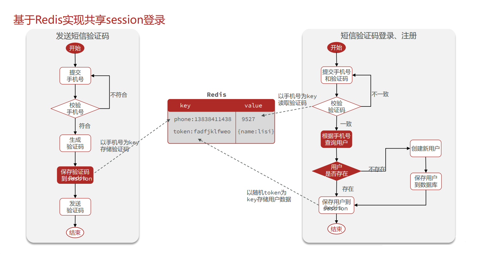

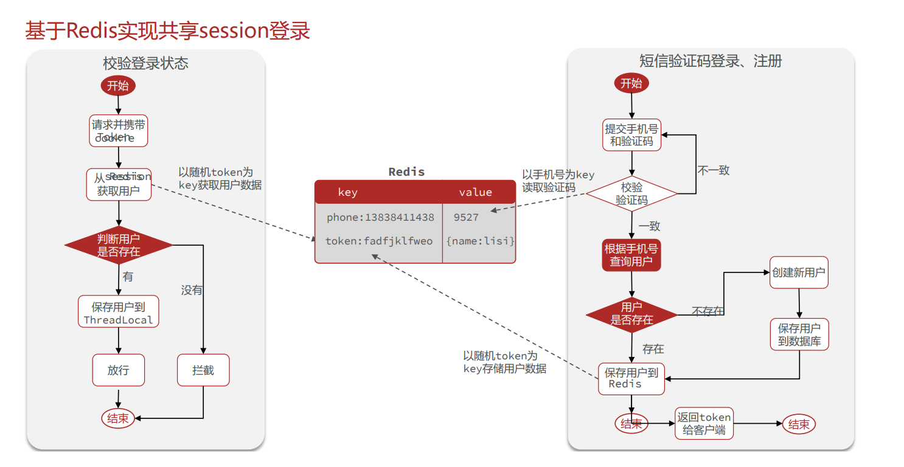


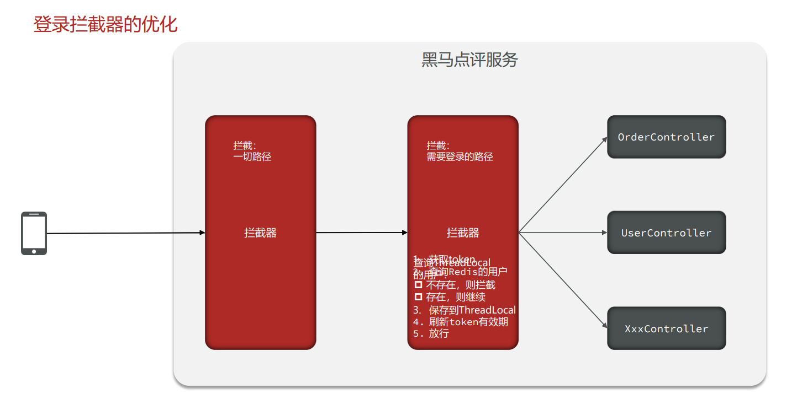


## UserService 实现

```java
package com.hmdp.service.impl;

import cn.hutool.core.bean.BeanUtil;
import cn.hutool.core.lang.UUID;
import cn.hutool.core.util.RandomUtil;
import com.baomidou.mybatisplus.core.toolkit.ObjectUtils;
import com.baomidou.mybatisplus.extension.service.impl.ServiceImpl;
import com.hmdp.dto.LoginFormDTO;
import com.hmdp.dto.Result;
import com.hmdp.dto.UserDTO;
import com.hmdp.entity.User;
import com.hmdp.mapper.UserMapper;
import com.hmdp.service.IUserService;
import com.hmdp.utils.RedisConstants;
import com.hmdp.utils.RegexUtils;
import com.hmdp.utils.SystemConstants;
import org.springframework.data.redis.core.StringRedisTemplate;
import org.springframework.stereotype.Service;

import javax.annotation.Resource;
import javax.servlet.http.HttpSession;
import java.util.HashMap;
import java.util.Map;
import java.util.Objects;
import java.util.concurrent.TimeUnit;


@Service
public class UserServiceImpl extends ServiceImpl<UserMapper, User> implements IUserService {


    /**
     * 注入RedisTemplate
     */
    @Resource  //Resource 注入时 对象名不能瞎起
    //@Autowired
    private StringRedisTemplate stringRedisTemplate;

    /**
     * 发送手机验证码 redis
     */
    @Override
    public Result sendCode(String phone, HttpSession session) {
        //验证手机号格式是否正确
        boolean phoneInvalid = RegexUtils.isPhoneInvalid(phone);
        if (RegexUtils.isPhoneInvalid(phone)) {
            return Result.fail("手机号格式错误！");
        }

        //生成验证码
        String code = RandomUtil.randomNumbers(6);

        //将验证码发送在Redis当中
        stringRedisTemplate.opsForValue().set(
                RedisConstants.LOGIN_CODE_KEY + phone,
                code,
                RedisConstants.LOGIN_CODE_TTL, // 5分钟
                TimeUnit.MINUTES);

        //发送验证码  模拟
        log.debug("[模拟]发送验证码:" + code);
        //返回结果 ok
        return Result.ok();
    }

    /**
     * 登录功能 redis
     */
    @Override
    public Result login(LoginFormDTO loginForm, HttpSession session) {
        //验证手机号是否正确
        String phone = loginForm.getPhone();
        if (RegexUtils.isPhoneInvalid(phone)) {
            return Result.fail("手机号格式错误！");
        }
        //用户输入的验证码
        String code = loginForm.getCode();

        //取出redis中的验证码
        String codeRedis = stringRedisTemplate.opsForValue().get(RedisConstants.LOGIN_CODE_KEY + phone);

        //与redis存储的验证码进行比对
        if (!Objects.equals(codeRedis, code)) {
            return Result.fail("验证码错误！");
        }
        //当前手机号是否存在用户
        User user = query().eq("phone", phone).one();
        //不存在：通过手机号创建新用户  登录用户 保持到session当中
        if (ObjectUtils.isEmpty(user)) {
            user = createUserWithPhone(phone);
        }
        //存在：  登录用户 保持到redis当中
        //不管用户是否存在都要 登录用户 保持到reids当中

        //转成 UserDTO 对象 【增加安全】
        UserDTO userDTO = BeanUtil.copyProperties(user, UserDTO.class);

        //将 UserDTO 对象 保存在redis 使用hash结构
        // 键：token
        String token = RedisConstants.LOGIN_USER_KEY + UUID.randomUUID().toString(true);
        // 值：用户信息
        Map<String, String> userMap = new HashMap<>();
        userMap.put(UserDTO.USER_DTO_ID, userDTO.getId().toString());
        userMap.put(UserDTO.USER_DTO_NICKNAME, userDTO.getNickName());
        userMap.put(UserDTO.USER_DTO_ICON, userDTO.getIcon());
        //存储
        stringRedisTemplate.opsForHash().putAll(token, userMap);
        //设置有效时间
        stringRedisTemplate.expire(token, RedisConstants.LOGIN_USER_TTL, TimeUnit.MINUTES);

        //返回给前端用户数据 token
        return Result.ok(token);
    }

    /**
     * 通过手机号创建用户
     */
    public User createUserWithPhone(String phone) {
        //生成一个随机用户名
        String userName = SystemConstants.USER_NICK_NAME_PREFIX + RandomUtil.randomString(8);
        User user = new User();
        user.setPhone(phone);
        user.setNickName(userName);
        save(user);
        return user;
    }
}
```


## 拦截器的实现

```java
package com.hmdp.config;

import com.hmdp.interceptor.LoginInterceptor;
import com.hmdp.interceptor.RefreshTokenInterceptor;
import org.springframework.context.annotation.Configuration;
import org.springframework.data.redis.core.StringRedisTemplate;
import org.springframework.web.servlet.config.annotation.InterceptorRegistry;
import org.springframework.web.servlet.config.annotation.WebMvcConfigurer;

import javax.annotation.Resource;

@Configuration
public class MvcConfig implements WebMvcConfigurer {

    @Resource
    private StringRedisTemplate stringRedisTemplate;

    /**
     * 关于拦截器的顺序问题：
     *      当添加多个拦截器的时候，第一个添加的默认的拦截器顺序是0，后面添加的依次递增
     *          顺序的两种解决方案：
     *              1. 先过滤的过滤器 先添加 即：按过滤的顺序依次 registry.addInterceptor()
     *              2. 使用 registry.addInterceptor().order() order方法手动设置过滤顺序: 0 > 1 > 2 > ...
     * @param registry
     */
    @Override
    public void addInterceptors(InterceptorRegistry registry) {
        registry.addInterceptor(new LoginInterceptor())
                .excludePathPatterns(
                        "/shop/**",
                        "/voucher/**",
                        "/shop-type/**",
                        "/upload/**",
                        "/blog/hot",
                        "/user/code",
                        "/user/login"
                ).order(1);
        registry.addInterceptor(new RefreshTokenInterceptor(stringRedisTemplate)).order(0);
    }


}
```


---

---


# Redis 缓存相关


## 什么是缓存

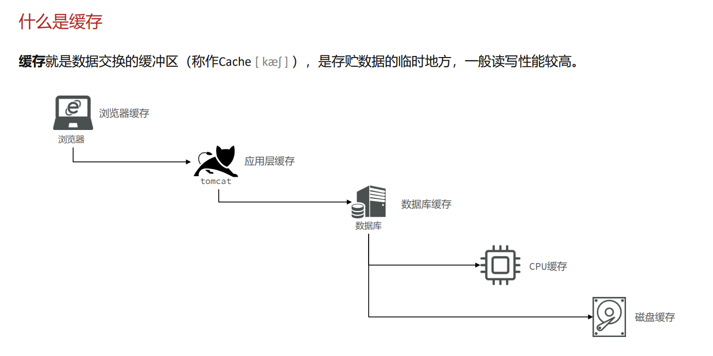


## 缓存作用和成本

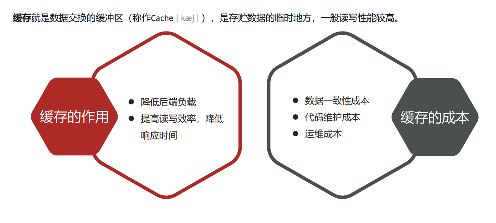


## 缓存更新策略

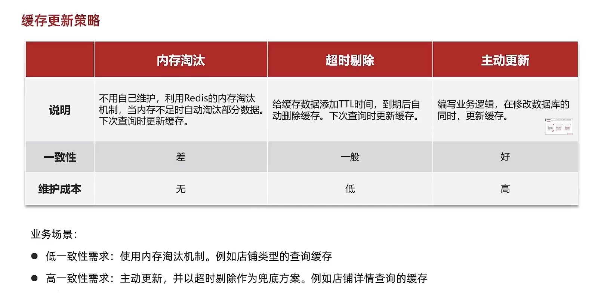


### 主动更新策略

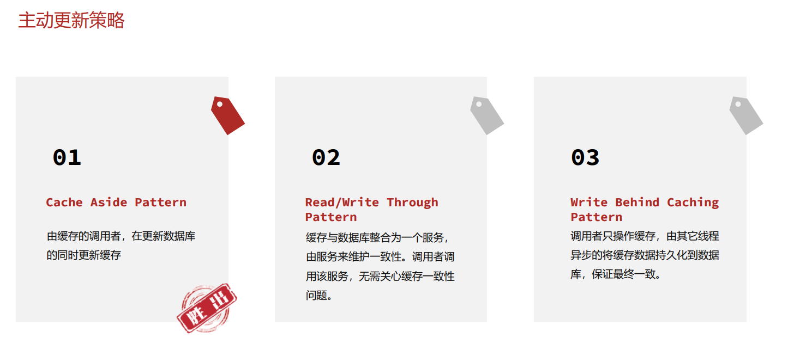


### Cache Adide Pattern

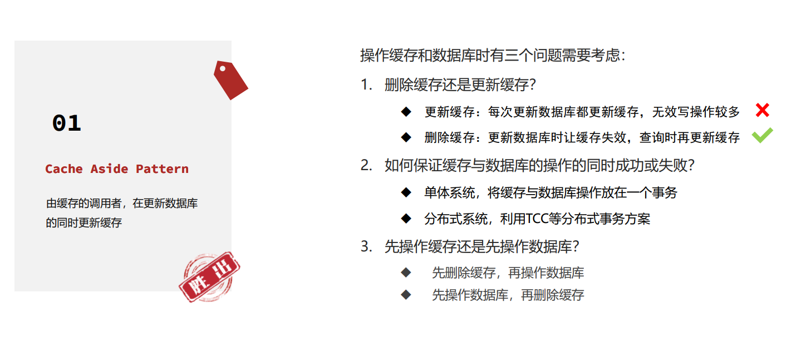

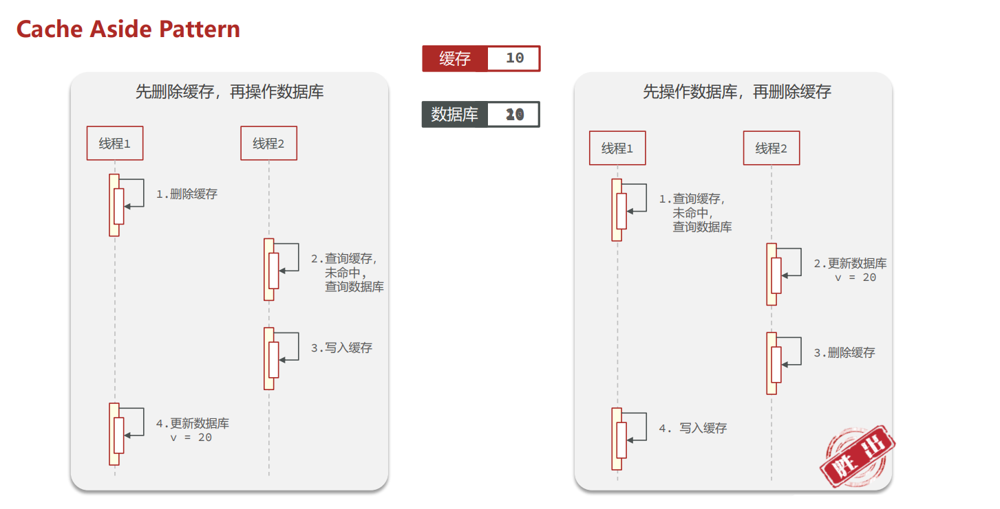


### 缓存更新策略最佳方案

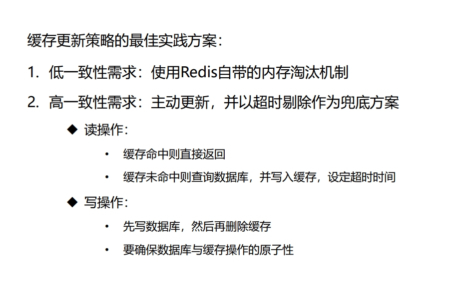


## 缓存穿透


### 什么是缓存穿透

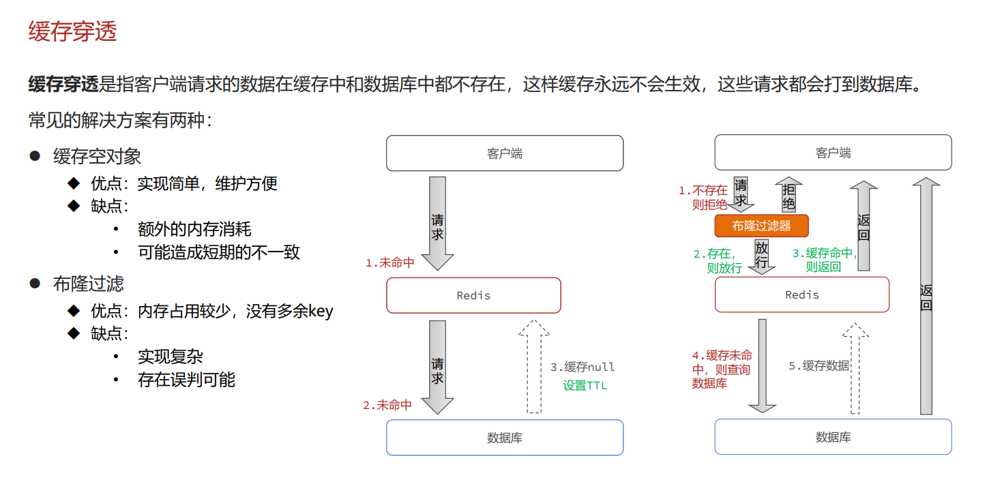


### 缓存空对象解决方案

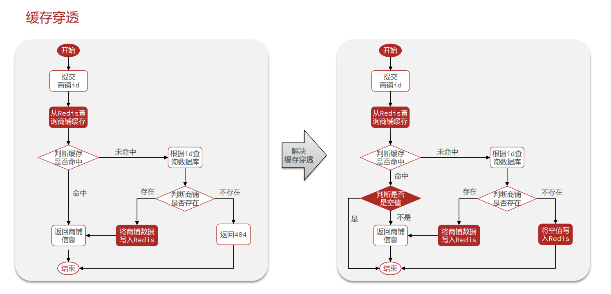


### 缓存穿透产生的原因是什么？

- 用户请求的数据在缓存中和数据库中都不存在，不断发起这样的请 求，给数据库带来巨大压力 缓存穿透的解决方案有哪些？

- 被动防御

  - 缓存null值
  - 布隆过滤

- 主动防御

  - 增强id的复杂度，避免被猜测id规律

  - 做好数据的基础格式校验

  - 加强用户权限校验

  - 做好热点参数的限流


---


## 缓存雪崩


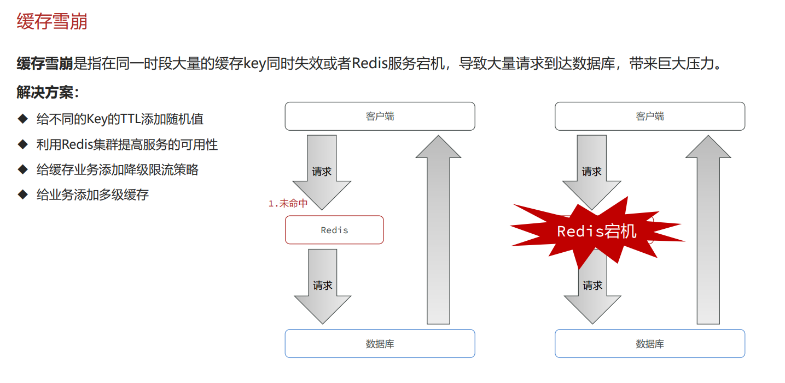


## 缓存击穿


### 什么是缓存击穿

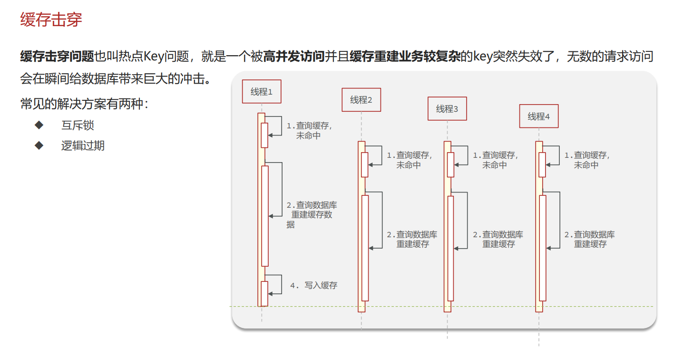


### 缓存击穿解决方案

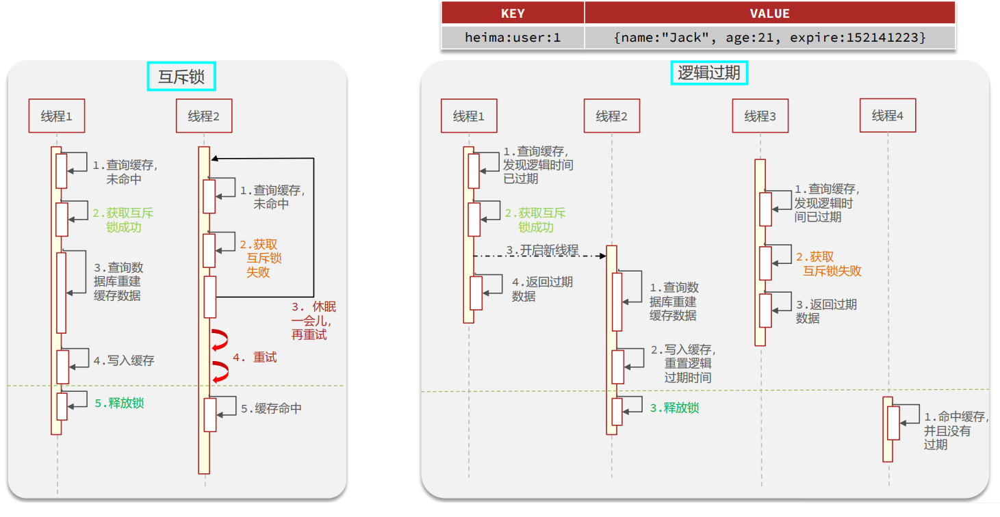


### 两种方案的优缺点

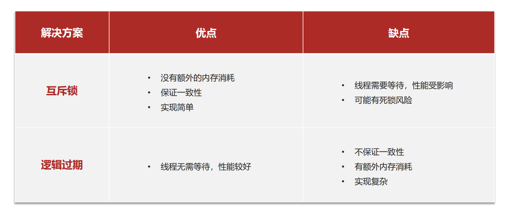

**一致还是性能，这是个值得思考的问题～ **


### 案例解决方案

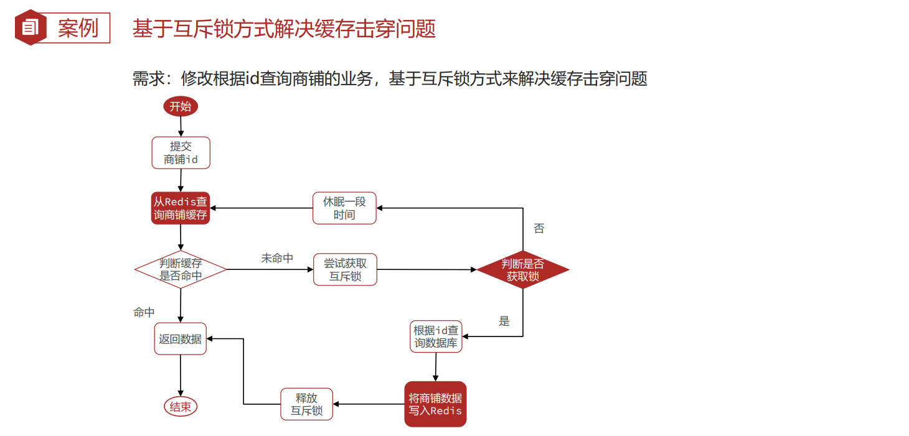


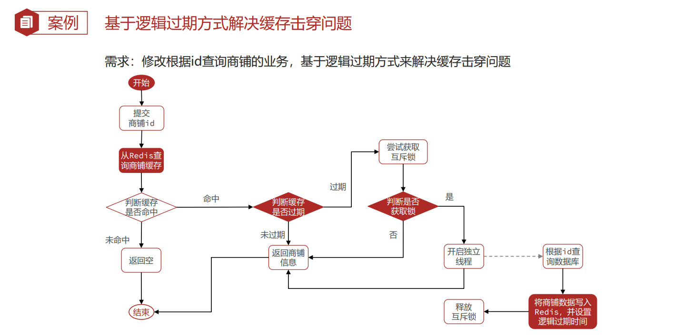


## 缓存案例


```java
@Override
public Result queryById(Long id) {

    //使用缓存
    //Result result = queryByIdCache(id);

    //使用缓存解决 [缓存穿透] 问题
    //Result result = queryByIdCachePenetration(id);

    //使用缓存解决 [缓存击穿] 问题 方案一： [互斥锁方案]
    //Result result = queryByIdCacheMutex(id);

    //使用缓存解决 [缓存击穿] 问题 方案一： [逻辑过期方案]
    //Result result = queryByIdCacheLogicalExpire(id);

    //不存在，返回404
    return result;
}
```


### 缓存穿透  ---缓存空对象

```java
/**
 * 解决缓存穿透问题
 * 使用 缓存空对象 解决方案
 *
 * @param id
 * @return
 */
public Result queryByIdCachePenetration(Long id) {

    //1. 获取商品id的key
    String key = RedisConstants.CACHE_SHOP_KEY + id;
    //2. 通过key向redis缓存中查询数据
    String shopStr = stringRedisTemplate.opsForValue().get(key);
    //3. 如果命中，返回查询结果
    if (ObjectUtil.isNotEmpty(shopStr)) {
        Shop shop = JSONUtil.toBean(shopStr, Shop.class); //转成对象
        return Result.ok(shop);
    }

    //3.1 判断是否命中的是空值
    if (shopStr != null) {
        return null;
    }

    //4. 如果未命中，查询数据库
    //5. 通过id查询数据库
    Shop shopById = this.getById(id);
    //6. 存在，写入redis缓存，并返回查询结果
    if (ObjectUtil.isNotEmpty(shopById)) {
        stringRedisTemplate.opsForValue().set(key, JSONUtil.toJsonStr(shopById));
        return Result.ok(shopById);
    }

    //7. 不存在，向redis写入空对象
    stringRedisTemplate.opsForValue().set(
        RedisConstants.CACHE_SHOP_KEY + id, "", RedisConstants.CACHE_SHOP_NOLL_TTL, TimeUnit.SECONDS);

    //8. 向前端返回信息
    return Result.fail("查询的商品不存在");
}
```


### 缓存击穿 ---互斥锁方案

```java
/**
 * 解决缓存击穿问题
 * 使用 互斥锁解决方案
 *
 * @param id
 * @return
 */
public Result queryByIdCacheMutex(Long id) {

    //1. 获取商品id的key
    String key = RedisConstants.CACHE_SHOP_KEY + id;
    //2. 通过key向redis缓存中查询数据
    String shopStr = stringRedisTemplate.opsForValue().get(key);
    //3. 如果命中，返回查询结果
    if (ObjectUtil.isNotEmpty(shopStr)) {
        Shop shop = JSONUtil.toBean(shopStr, Shop.class); //转成对象
        return Result.ok(shop);
    }

    //3.1 判断是否命中的是空值
    if (shopStr != null) {
        return null;
    }

    //4. 如果未命中，进行缓存重建
    try {

        //4.1 获取互斥锁
        boolean lock = setShopMutex(id);

        //4.2 判断互斥锁是否获取成功 不成功，等待 + 递归
        if (!lock) {
            Thread.sleep(500); //等到500毫秒
            queryByIdCacheMutex(id); //递归
        }

        //4.3 获取互斥锁成功 通过id查询数据库
        Shop shopById = this.getById(id);

        //4.4 存在，写入redis缓存，并返回查询结果
        if (ObjectUtil.isNotEmpty(shopById)) {
            stringRedisTemplate.opsForValue().set(key, JSONUtil.toJsonStr(shopById));
            return Result.ok(shopById);
        }

        //4.5 不存在，向redis写入空对象
        stringRedisTemplate.opsForValue()
            .set
            (RedisConstants.CACHE_SHOP_KEY + id, "", RedisConstants.CACHE_SHOP_NOLL_TTL, TimeUnit.SECONDS);

    } catch (InterruptedException e) {
        throw new RuntimeException(e);
    } finally {

        //4.6 释放互斥锁
        delShopMutex(id);
    }

    //5. 向前端返回信息
    return Result.fail("查询的商品不存在");
}
```


### 互斥锁的简单构建

```java
//获取互斥锁
public boolean setShopMutex(Long id) {
    //使用 .setIfAbsent()方法
    Boolean lock = stringRedisTemplate.opsForValue().setIfAbsent(RedisConstants.LOCK_SHOP_KEY + id, "lock", RedisConstants.LOCK_SHOP_TTL, TimeUnit.SECONDS);
    return BooleanUtil.isTrue(lock);
}

//删除互斥锁
public void delShopMutex(Long id) {
    stringRedisTemplate.delete(RedisConstants.LOCK_SHOP_KEY + id);
}
```


### 缓存击穿 ---逻辑过期方案


### 数据的变动

```java
import lombok.Data;
import java.time.LocalDateTime;

/**
 * 存储 数据 + 逻辑时间
 */
@Data
public class RedisData {
    private LocalDateTime expireTime;
    private Object data;
}
```


缓存重建方法

```java
//缓存重建
public void saveShopRedis(Long id, Long expireSeconds) {

    //模拟重建时间
    System.out.println("休眠中");
    try {
        Thread.sleep(200);
    } catch (InterruptedException e) {
        throw new RuntimeException(e);
    }
    System.out.println("休眠结束");

    //查询数据库数据
    Shop shop = this.getById(id);
    //封装 数据+逻辑时间
    RedisData redisData = new RedisData();
    redisData.setData(shop); //数据
    redisData.setExpireTime(LocalDateTime.now().plusSeconds(expireSeconds)); //时间
    //序列化
    String json = JSONUtil.toJsonStr(redisData);
    //写入redis缓存当中
    stringRedisTemplate.opsForValue().set(RedisConstants.CACHE_SHOP_KEY + id, json);
}
```


业务逻辑

```java
/**
 * 解决缓存击穿问题
 * 使用 逻辑过期解决方案
 *
 * @param id
 * @return
 */
public Result queryByIdCacheLogicalExpire(Long id) {

    //1. 查询缓存是否命中
    String jsonData = stringRedisTemplate.opsForValue().get(RedisConstants.CACHE_SHOP_KEY + id);
    //2. 未命中直接返回前端信息
    if (ObjectUtil.isEmpty(jsonData)) {
        return Result.fail("查询的商品不存在！");
    }
    //3. 命中
    //4. 反序列化数据
    RedisData redisData = JSONUtil.toBean(jsonData, RedisData.class);
    JSONObject data = (JSONObject) redisData.getData(); //转成 JSONObject对象
    Shop shop = JSONUtil.toBean(data, Shop.class); //转成 Shop 对象
    LocalDateTime expireTime = redisData.getExpireTime(); //获取逻辑时间
    //5. 判断逻辑时间是否过去
    if (expireTime.isAfter(LocalDateTime.now())) { //expireTime.isAfter(LocalDateTime.now()) --> true:未过期  false：过期
        //6. 逻辑时间未过期 直接向前端返回数据
        return Result.ok(shop);
    }
    //7. 逻辑时间过期 尝试获取互斥锁
    boolean lock = setShopMutex(id);
    //8. 获取互斥成功
    if (lock) {
        //9. 开启新的线程
        CACHE_REBUILD_EXECUTOR.submit(() -> {
            try {
                //10. 重建缓存
                saveShopRedis(id, 10L);
            } finally {
                //11. 释放锁
                delShopMutex(id);
            }
        });
    }

    //12. 返回旧数据
    return Result.ok(shop);
}
```


## 缓存工具封装


**U基于StringRedisTemplate封装一个缓存工具类，满足下列需求： **

✓ 方法1：将任意Java对象序列化为json并存储在string类型的key中，并且可以设置TTL过期时间


✓ 方法2：将任意Java对象序列化为json并存储在string类型的key中，并且可以设置逻辑过期时间，用于处理缓存 击穿问题


✓ 方法3：根据指定的key查询缓存，并反序列化为指定类型，利用缓存空值的方式解决缓存穿透问题


✓ 方法4：根据指定的key查询缓存，并反序列化为指定类型，需要利用逻辑过期解决缓存击穿问题


```java
package com.hmdp.utils;


import cn.hutool.core.util.BooleanUtil;
import cn.hutool.core.util.ObjectUtil;
import cn.hutool.json.JSONObject;
import cn.hutool.json.JSONUtil;
import lombok.extern.slf4j.Slf4j;
import org.springframework.data.redis.core.StringRedisTemplate;
import org.springframework.stereotype.Component;

import javax.annotation.Resource;
import java.time.LocalDateTime;
import java.util.concurrent.ExecutorService;
import java.util.concurrent.Executors;
import java.util.concurrent.TimeUnit;
import java.util.function.Function;

/**
 * 封装缓存工具类
 */
@Slf4j
@Component
public class CacheClient {

    //注入RedisTemplate
    @Resource
    private StringRedisTemplate stringRedisTemplate;


    //自定义线程池
    private static final ExecutorService CACHE_REBUILD_EXECUTOR = Executors.newFixedThreadPool(10);


    //✓ 方法1：将任意Java对象序列化为json并存储在string类型的key中，并且可以设置TTL过期时间
    public <ID> void setCache(String prefix, ID id, Object value, Long time, TimeUnit timeUnit){
        //序列化 并写入redis缓存
        String key = prefix + id;
        stringRedisTemplate.opsForValue().set(key, JSONUtil.toJsonStr(value),time,timeUnit);
    }


    //✓ 方法2：将任意Java对象序列化为json并存储在string类型的key中，并且可以设置逻辑过期时间，用于处理缓存 击穿问题
    public <ID> void setWithLogicalExpire(String prefix, ID id, Object value, Long timeSeconds){
        String key = prefix + id;
        //封装成 RedisData类型
        RedisData redisData = new RedisData();
        redisData.setExpireTime(LocalDateTime.now().plusSeconds(timeSeconds));
        redisData.setData(value);
        //序列化
        String json = JSONUtil.toJsonStr(redisData);
        //写入redis缓存
        stringRedisTemplate.opsForValue().set(key, json);
    }
    // ✓ 方法2的另一种写法，+缓存重建
    public <R,ID> R newCache(String key, ID id, Long time, TimeUnit timeUnit, Function<ID, R> sqlFunction){
        //获取数据库数据
        R rs = sqlFunction.apply(id);
        //是否存在数据 不存在
        if (ObjectUtil.isEmpty(rs)){
            return null;
        }
        //序列化 并 封装
        RedisData redisData = new RedisData();
        redisData.setExpireTime(LocalDateTime.now().plusSeconds(timeUnit.toSeconds(time)));
        redisData.setData(rs);
        String value = JSONUtil.toJsonStr(redisData);
        //写入缓存
        stringRedisTemplate.opsForValue().set(key,value);

        //将数据库中的数据返回
        return rs;
    }


    //======================================================================================


    // 缓存击穿
    //✓ 方法3：根据指定的key查询缓存，并反序列化为指定类型，利用缓存空值的方式解决缓存穿透问题
    public <R,ID> R queryWithPassThrough(
            String keyPrefix,
            ID id, Class<R> type,
            Function<ID,R> sqlFunction,
            Long time, TimeUnit timeUnit,
            Long timeNull, TimeUnit timeUnitNull){

        String key = keyPrefix + id;
        //从数据库中查询 key 数据
        String jsonStr = stringRedisTemplate.opsForValue().get(key);
        //判断是否命中 命中
        if (ObjectUtil.isNotEmpty(jsonStr)){
            //反序列化对象 并返回调用者
            return JSONUtil.toBean(jsonStr, type);
        }

        //未命中 先判断是否为空值
        if (jsonStr != null){
            //返回错误信息
            return null;
        }

        //数据库调用 日志
        log.info("数据库被调用...");

        //未命中 并且 没对象对象 重建缓存
        R sqlData = sqlFunction.apply(id);
        //判断是否存在
        if (ObjectUtil.isNotEmpty(sqlData)){
            //存在 序列化 并且写入缓存
            this.setCache(keyPrefix,id,sqlData,time,timeUnit);
            //返回调用者数据
            return sqlData;
        }
        //不存在 缓存空对象
        stringRedisTemplate.opsForValue().set(keyPrefix+id,"",timeNull,timeUnitNull);

        return null;
    }


    //缓存击穿

    //互斥锁方案
    //✓ 方法4.1：根据指定的key查询缓存，并反序列化为指定类型，需要利用逻辑过期解决缓存击穿问题
    public <R,ID> R queryWithMutex(
            String keyPrefix, String lockPrefix,
            Long keyTime, TimeUnit keyTimeUnit,
            Long nullTime, TimeUnit nullTimeUnit,
            Long lockTime, TimeUnit lockTimeUnit,
            ID id,
            Class<R> type, //返回值类型
            //函数式 sql具体实现
            Function<ID,R> sqlFunction){

        String key = keyPrefix + id;
        //通过缓存进行查询
        String jsonStr = stringRedisTemplate.opsForValue().get(key);
        //命中 反序列化并返回调用者
        if(ObjectUtil.isNotEmpty(jsonStr)){
            return JSONUtil.toBean(jsonStr,type);
        }
        //未命中 判断是否为空值
        if (jsonStr != null){
            //命中空对象 返回null
            return null;
        }

        //未命中 且 不为空对象 --> 缓存中无key-value
        //重建缓存
        //获取互斥锁
        try {
            boolean isLock = getCacheLock(lockPrefix, id, lockTime, lockTimeUnit);
            if (!isLock){

                //失败 线程等待
                Thread.sleep(600);
                //回调 递归
                this.queryWithMutex(
                        keyPrefix,lockPrefix,
                        keyTime,keyTimeUnit,
                        nullTime,nullTimeUnit,
                        lockTime,lockTimeUnit,
                        id,type,sqlFunction);
            }


            String str = stringRedisTemplate.opsForValue().get(key);
            if (ObjectUtil.isNotEmpty(str)){
                return JSONUtil.toBean(str,type);
            }

            //获取互斥锁成功 查询数据库数据
            R rd = sqlFunction.apply(id);
            if (ObjectUtil.isNotEmpty(rd)){
                //重建缓存
                //存在： 调用 this.setCache
                this.setCache(keyPrefix,id,rd,keyTime,keyTimeUnit);
                return rd;
            }

            //不存在： 写入缓存空对象
            stringRedisTemplate.opsForValue().set(key,"",nullTime,nullTimeUnit);

        } catch (Exception e) {
            throw new RuntimeException(e);
        } finally {
            //释放锁
            this.delCacheLock(lockPrefix,id);
        }

        return null;
    }


    //✓ 方法4.2：根据指定的key查询缓存，并反序列化为指定类型，需要利用逻辑过期解决缓存击穿问题
    public <R,ID> R queryWithLogicalExpire(
            String keyPrefix, String lockPrefix,
            Long time, TimeUnit timeUnit,
            Long lockTime, TimeUnit lockTimeUnit,
            ID id, R r, Class<R> type,
            Function<ID,R> sqlFunction){


        String key = keyPrefix + id;
        //通过缓存查询
        String jsonStr = stringRedisTemplate.opsForValue().get(key);
        //判断是否命中 未命中
        if (ObjectUtil.isEmpty(jsonStr)){
            //直接向前端返回null
        }
        //命中
        //反序列化 并 拆分 RedisData
        RedisData redisData = JSONUtil.toBean(jsonStr, RedisData.class);
        LocalDateTime expireTime = redisData.getExpireTime();
        JSONObject jsonObject = (JSONObject) redisData.getData();
        R rd = JSONUtil.toBean(jsonObject, type);

        //判断逻辑时间是否过期
        if (expireTime.isAfter(LocalDateTime.now())){
            //未过期 直接返回数据
            return rd;
        }
        //逻辑时间过期 获取互斥锁
        boolean cacheLock = this.getCacheLock(lockPrefix, id, lockTime, lockTimeUnit);
        //获取互斥锁成功
        if (cacheLock){
            //获取新线程
            CACHE_REBUILD_EXECUTOR.submit(()->{
                try {
                    //重建缓存
                    this.newCache(key,id,time,timeUnit,sqlFunction);
                } finally {
                    //释放锁
                    this.delCacheLock(lockPrefix,id);
                }
            });
        }

        //先将旧数据返回给调用者  失去的一致性 但提高了性能！
        return rd;
    }


    //另外的 ： 互斥锁 Redis简单的实现

    //获取互斥锁
    public <ID> boolean getCacheLock(String prefix, ID id, Long time, TimeUnit timeUnit){
        String key = prefix + id;
        //创建Mutex
        Boolean ifs = stringRedisTemplate.opsForValue().setIfAbsent(key, RedisConstants.CACHE_LOCK_VALUE, time, timeUnit );
        //log.info("互斥锁已 [创建] ...");
        return BooleanUtil.isTrue(ifs); //为了防止自动拆箱 使用了工具类
    }

    //释放锁
    public <ID> void delCacheLock(String prefix, ID id){
        String key = prefix + id;
        // 删除Mutex
        stringRedisTemplate.delete(key);
        //log.info("互斥锁已 [删除] ...");
    }


}
```


# Redis生成全局ID方案

## 解决方案：

```java
package com.hmdp.utils;

import org.springframework.data.redis.core.StringRedisTemplate;
import org.springframework.stereotype.Component;

import java.time.LocalDateTime;
import java.time.ZoneOffset;
import java.time.format.DateTimeFormatter;

@Component
public class RedisIdWorker {

    /**
     * 开始时间戳
     */
    public static final long BEGIN_TIMESTAMP = 1640995200L; //2022,1,1,0,0

    /**
     * 时间戳移动的位数
     */
    public static final int COUNT_BITS = 32;

    /**
     * StringRedisTemplate对象
     */
    public StringRedisTemplate stringRedisTemplate;
    public RedisIdWorker(StringRedisTemplate stringRedisTemplate) {
        this.stringRedisTemplate = stringRedisTemplate;
    }

    /**
     * 生成全局id
     * @param keyPrefix
     * @return
     */
    public long nextId(String keyPrefix) {

        //当前时间戳
        LocalDateTime now = LocalDateTime.now();
        long nowTimestamp = now.toEpochSecond(ZoneOffset.UTC);
        long timestamp = nowTimestamp - BEGIN_TIMESTAMP;

        //获取自增
        //1.获取当前日期
        String format = now.format(DateTimeFormatter.ofPattern("yyyy:MM:dd"));
        //2.获取自增
        long count = stringRedisTemplate.opsForValue().increment("icr:" + keyPrefix + format);

        //计算并返回
        return timestamp << COUNT_BITS | count;
    }


/*
public static void main(String[] args) {
        LocalDateTime time = LocalDateTime.of(2022, 1, 1, 0, 0);
        long times = time.toEpochSecond(ZoneOffset.UTC);
        System.out.println(times);
}
*/

}
```


## 测试代码

```java
package com.hmdp;

import com.hmdp.utils.RedisIdWorker;
import org.junit.jupiter.api.Test;
import org.springframework.boot.test.context.SpringBootTest;
import org.springframework.test.context.ContextConfiguration;

import javax.annotation.Resource;
import java.time.LocalDateTime;
import java.time.ZoneOffset;
import java.util.concurrent.CountDownLatch;
import java.util.concurrent.ExecutorService;
import java.util.concurrent.Executors;

@SpringBootTest
@ContextConfiguration(classes = RedisIdWorkerApp.class)
class RedisIdWorkerTests {

    @Resource
    private RedisIdWorker redisIdWorker;

    public ExecutorService es= Executors.newFixedThreadPool(500);

    @Test
    void gitIdTest() throws InterruptedException {

        CountDownLatch countDownLatch = new CountDownLatch(300);

        //开始时间戳
        long startTimestamp = LocalDateTime.now().toEpochSecond(ZoneOffset.UTC);

        Runnable task = ()->{
            //一个任务生成100个id
            for (int i = 0; i < 100; i++) {
                long id = redisIdWorker.nextId("order");
                System.out.println(id);
            }
            countDownLatch.countDown();
        };

        //300个任务
        for (int i = 0; i < 300; i++) {
            es.submit(task);
        }

        countDownLatch.await();
        long stopTimestamp = LocalDateTime.now().toEpochSecond(ZoneOffset.UTC);
        System.out.println(stopTimestamp - startTimestamp);
    }


}
```


# TODO:


