# Redis 相关命令


## 关于安装

### Redis安装

Redis是基于C语言编写的，因此首先需要安装Redis所需要的gcc依赖：

```bash
yum install -y gcc tcl
```

解压缩：

压缩在 `/usr/local/src`下

```bash
tar -xzf redis-6.2.6.tar.gz
```

解压后：

进入redis目录：

```bash
cd redis-6.2.6
```

运行编译命令：

```bash
make && make install
```

如果没有出错，应该就安装成功了。

默认的安装路径是在 `/usr/local/bin`目录下：

该目录以及默认配置到环境变量，因此可以在任意目录下运行这些命令。其中：

- redis-cli：是redis提供的命令行客户端
- redis-server：是redis的服务端启动脚本
- redis-sentinel：是redis的哨兵启动脚本

---

**如果没有任意目录下启动**

修改profile文件：

```bash
vi /etc/profile 
```


在最后行添加:

```bash
export PATH=$PATH:/usr/local/bin
```

注意：/usr/local/bin表示的是redis-server 命令存在的目录路径

重新加载/etc/profile

```bash
source /etc/profile  
```


在任意目录执行命令

```bash
redis-server 
```


---

### **Redis配置文件**

我们先将这个配置文件备份一份：

```bash
cp redis.conf redis.conf.bck
```


然后修改redis.conf文件中的一些配置：

```properties
# 允许访问的地址，默认是127.0.0.1，会导致只能在本地访问。修改为0.0.0.0则可以在任意IP访问，生产环境不要设置为0.0.0.0
bind 0.0.0.0
# 守护进程，修改为yes后即可后台运行
daemonize yes 
# 密码，设置后访问Redis必须输入密码
requirepass 123321
```


Redis的其它常见配置：

```properties
# 监听的端口
port 6379
# 工作目录，默认是当前目录，也就是运行redis-server时的命令，日志、持久化等文件会保存在这个目录
dir .
# 数据库数量，设置为1，代表只使用1个库，默认有16个库，编号0~15
databases 1
# 设置redis能够使用的最大内存
maxmemory 512mb
# 日志文件，默认为空，不记录日志，可以指定日志文件名
logfile "redis.log"
```


启动Redis：

```sh
# 进入redis安装目录 
cd /usr/local/src/redis-6.2.6
# 启动
redis-server redis.conf
```


停止服务：

```sh
# 利用redis-cli来执行 shutdown 命令，即可停止 Redis 服务，
# 因为之前配置了密码，因此需要通过 -u 来指定密码
redis-cli -u 123321 shutdown
```


---

### 设置自启动

我们也可以通过配置来实现开机自启。

首先，新建一个系统服务文件：

```sh
vi /etc/systemd/system/redis.service
```

内容如下：

```properties
[Unit]
Description=redis-server
After=network.target

[Service]
Type=forking
ExecStart=/usr/local/bin/redis-server /usr/local/src/redis-6.2.6/redis.conf
PrivateTmp=true

[Install]
WantedBy=multi-user.target
```


然后重载系统服务：

```sh
systemctl daemon-reload
```


现在，我们可以用下面这组命令来操作redis了：

```bash
# 启动
systemctl start redis
# 停止
systemctl stop redis
# 重启
systemctl restart redis
# 查看状态
systemctl status redis
```


执行下面的命令，可以让redis开机自启：

```bash
systemctl enable redis
```


---

### 进入客户端

Redis安装完成后就自带了命令行客户端：redis-cli，使用方式如下：

```sh
redis-cli [options] [commonds]
```

其中常见的options有：

- `-h 127.0.0.1`：指定要连接的redis节点的IP地址，默认是127.0.0.1
- `-p 6379`：指定要连接的redis节点的端口，默认是6379
- `-a 123321`：指定redis的访问密码

其中的commonds就是Redis的操作命令，例如：

- `ping`：与redis服务端做心跳测试，服务端正常会返回`pong`

不指定commond时，会进入`redis-cli`的交互控制台：


还可以这样：

```bash
[root@gangajiang ~]# redis-cli -h 127.0.0.1 -p 6379
127.0.0.1:6379> auth 密码
OK
127.0.0.1:6379> ping
PONG
```


### 可视化工具

resp for windows

[Windows版本](https://github.com/lework/RedisDesktopManager-Windows)


---


## 通用命令

Redis通用命令

help + 关键字  ：查看该关键字用法

通用指令是部分数据类型的，都可以使用的指令，常见的有：

- KEYS：查看符合模板的所有key
  - *全部  / 占多个字符
  -  ?占一个字符

- DEL：删除一个指定的key

- EXISTS：判断key是否存在

- EXPIRE：给一个key设置有效期，有效期到期时该key会被自动删除

- TTL：查看一个KEY的剩余有效期

- RENAME: 对一个key重命名


---


## String类型的常见命令

String类型，也就是字符串类型，是Redis中最简单的存储类型。 其value是字符串，不过根据字符串的格式不同，又可以分为3类：

- string：普通字符串
- int：整数类型，可以做自增、自减操作
- float：浮点类型，可以做自增、自减操作


String的常见命令有：

- SET：添加或者修改已经存在的一个String类型的键值对
- GET：根据key获取String类型的value
- MSET：批量添加多个String类型的键值对
- MGET：根据多个key获取多个String类型的value
- INCR：让一个整型的key自增1
- INCRBY: 让一个整型的key自增并指定步长，例如：incrby num 2 让num值自增2
- INCRBYFLOAT：让一个浮点类型的数字自增并指定步长
- SETNX：添加一个String类型的键值对，前提是这个key不存在，否则不执行
- SETEX：添加一个String类型的键值对，并且指定有效期


---


## key的结构


Redis的key允许有多个单词形成层级结构，多个单词之间用':'隔开，格式如下：

**项目名:业务名:类型:id**


这个格式并非固定，也可以根据自己的需求来删除或添加词条。

例如我们的项目名称叫 heima，有user和product两种不同类型的数据，我们可以这样定义key：

◆ user相关的key：heima:user:1

◆ product相关的key：heima:product:1


如果Value是一个Java对象，例如一个User对象，则可以将对象序列化为JSON字符串后存储：


| KEY             | VALUE                                     |
| --------------- | ----------------------------------------- |
| ganga:user:1    | {"id":1, "name": "Jack", "age": 21}       |
| ganga:product:1 | {"id":1, "name": "小米11", "price": 4999} |

```
set ganga:user:1 '{"id":1, "name": "Jack", "age": 21}'
set ganga:product:1 '{"id":1, "name": "小米11", "price": 4999}'

```


| KEY             | VALUE                                   |
| --------------- | --------------------------------------- |
| ganga:user:2    | {"id":2, "name":"Rose", "age": 18}      |
| ganga:product:2 | {"id":2, "name":"荣耀6", "price": 2999} |

```bash
set ganga:user:2 '{"id":2, "name":"Rose", "age": 18}'
set ganga:product:2 '{"id":2, "name":"荣耀6", "price": 2999}'
```


---

## Hash类型


Hash类型，也叫散列，其value是一个无序字典，类似于Java中的HashMap结构。

String结构是将对象序列化为JSON字符串后存储，当需要修改对象某个字段时很不方便：

Hash结构可以将对象中的每个字段独立存储，可以针对单个字段做CRUD：


Hash的常见命令有：

- HSET key field value：添加或者修改hash类型key的field的值
- HGET key field：获取一个hash类型key的field的值
- HMSET：批量添加多个hash类型key的field的值
- HMGET：批量获取多个hash类型key的field的值
- HGETALL：获取一个hash类型的key中的所有的field和value
- HKEYS：获取一个hash类型的key中的所有的field
- HVALS：获取一个hash类型的key中的所有的value
- HINCRBY:让一个hash类型key的字段值自增并指定步长
- HSETNX：添加一个hash类型的key的field值，前提是这个field不存在，否则不执行


---


## List类型


Redis中的List类型与Java中的LinkedList类似，可以看做是一个双向链表结构。

既可以支持正向检索和也可以支持反 向检索。

特征也与LinkedList类似：

- 有序

- 元素可以重复

- 插入和删除快

- 查询速度一般

常用来存储一个有序数据，例如：朋友圈点赞列表，评论列表等。


**List类型的常见命令**

List的常见命令有：

- LPUSH key element ... ：向列表左侧插入一个或多个元素
- LPOP key：移除并返回列表左侧的第一个元素，没有则返回nil  // 第一个元素是一
- RPUSH key element ... ：向列表右侧插入一个或多个元素
- RPOP key：移除并返回列表右侧的第一个元素
- LRANGE key star end：返回一段角标范围内的所有元素          l   // 第一个范围是零
- BLPOP和BRPOP：与LPOP和RPOP类似，只不过在没有元素时等待指定时间，而不是直接返回nil


---


## Set类型


Redis的Set结构与Java中的HashSet类似，可以看做是一个value为null的HashMap。

因为也是一个hash表，因此具 备与HashSet类似的特征：

- 无序
- 元素不可重复
- 查找快
- 支持交集、并集、差集等功能


**Set类型的常见命令**

String的常见命令有：

- SADD key member ... ：向set中添加一个或多个元素
- SREM key member ... : 移除set中的指定元素
- SCARD key： 返回set中元素的个数
- SISMEMBER key member：判断一个元素是否存在于set中
- SMEMBERS：获取set中的所有元素
- SINTER key1 key2 ... ：求key1与key2的交集
- SDIFF key1 key2 ... ：求key1与key2的差集
- SUNION key1 key2 ..：求key1和key2的并集


---

---


## SortedSet类型

Redis的SortedSet是一个可排序的set集合，与Java中的TreeSet有些类似，但底层数据结构却差别很大。SortedSet 中的每一个元素都带有一个score属性，可以基于score属性对元素排序，底层的实现是一个**跳表（SkipList）加 hash表**。

* *SortedSet具备下列特性：**

- 可排序
- 元素不重复
- 查询速度快

因为SortedSet的可排序特性，**经常被用来实现排行榜这样的功能。**


---


**SortedSet类型的常见命令**

SortedSet的常见命令有：

- ZADD key score member：添加一个或多个元素到sorted set ，如果已经存在则更新其score值
- ZREM key member：删除sorted set中的一个指定元素
- ZSCORE key member : 获取sorted set中的指定元素的score值
- ZRANK key member：获取sorted set 中的指定元素的排名
- ZCARD key：获取sorted set中的元素个数
- ZCOUNT key min max：统计score值在给定范围内的所有元素的个数
- ZINCRBY key increment member：让sorted set中的指定元素自增，步长为指定的increment值
- ZRANGE key min max：按照score排序后，获取指定排名范围内的元素
- ZRANGEBYSCORE key min max：按照score排序后，获取指定score范围内的元素
- ZDIFF、ZINTER、ZUNION：求差集、交集、并集 注意：所有的排名默认都是升序，如果要降序则在命令的Z后面添加REV即可


---


# Redis 实现短信登陆功能


pom.xml  依赖文件

```xml
<dependencies>
    <dependency>
        <groupId>org.springframework.boot</groupId>
        <artifactId>spring-boot-starter-data-redis</artifactId>
    </dependency>

    <dependency>
        <groupId>org.apache.commons</groupId>
        <artifactId>commons-pool2</artifactId>
    </dependency>

    <dependency>
        <groupId>org.springframework.boot</groupId>
        <artifactId>spring-boot-starter-web</artifactId>
    </dependency>

    <dependency>
        <groupId>mysql</groupId>
        <artifactId>mysql-connector-java</artifactId>
        <scope>runtime</scope>
    </dependency>

    <dependency>
        <groupId>org.projectlombok</groupId>
        <artifactId>lombok</artifactId>
        <optional>true</optional>
    </dependency>

    <dependency>
        <groupId>org.springframework.boot</groupId>
        <artifactId>spring-boot-starter-test</artifactId>
        <scope>test</scope>
    </dependency>

    <dependency>
        <groupId>com.baomidou</groupId>
        <artifactId>mybatis-plus-boot-starter</artifactId>
        <version>3.4.3</version>
    </dependency>

    <!--hutool-->
    <dependency>
        <groupId>cn.hutool</groupId>
        <artifactId>hutool-all</artifactId>
        <version>5.8.5</version>
    </dependency>
</dependencies>
```


## 图解


## UserService 实现

```java
package com.hmdp.service.impl;

import cn.hutool.core.bean.BeanUtil;
import cn.hutool.core.lang.UUID;
import cn.hutool.core.util.RandomUtil;
import com.baomidou.mybatisplus.core.toolkit.ObjectUtils;
import com.baomidou.mybatisplus.extension.service.impl.ServiceImpl;
import com.hmdp.dto.LoginFormDTO;
import com.hmdp.dto.Result;
import com.hmdp.dto.UserDTO;
import com.hmdp.entity.User;
import com.hmdp.mapper.UserMapper;
import com.hmdp.service.IUserService;
import com.hmdp.utils.RedisConstants;
import com.hmdp.utils.RegexUtils;
import com.hmdp.utils.SystemConstants;
import org.springframework.data.redis.core.StringRedisTemplate;
import org.springframework.stereotype.Service;

import javax.annotation.Resource;
import javax.servlet.http.HttpSession;
import java.util.HashMap;
import java.util.Map;
import java.util.Objects;
import java.util.concurrent.TimeUnit;


@Service
public class UserServiceImpl extends ServiceImpl<UserMapper, User> implements IUserService {


    /**
     * 注入RedisTemplate
     */
    @Resource  //Resource 注入时 对象名不能瞎起
    //@Autowired
    private StringRedisTemplate stringRedisTemplate;

    /**
     * 发送手机验证码 redis
     */
    @Override
    public Result sendCode(String phone, HttpSession session) {
        //验证手机号格式是否正确
        boolean phoneInvalid = RegexUtils.isPhoneInvalid(phone);
        if (RegexUtils.isPhoneInvalid(phone)) {
            return Result.fail("手机号格式错误！");
        }

        //生成验证码
        String code = RandomUtil.randomNumbers(6);

        //将验证码发送在Redis当中
        stringRedisTemplate.opsForValue().set(
                RedisConstants.LOGIN_CODE_KEY + phone,
                code,
                RedisConstants.LOGIN_CODE_TTL, // 5分钟
                TimeUnit.MINUTES);

        //发送验证码  模拟
        log.debug("[模拟]发送验证码:" + code);
        //返回结果 ok
        return Result.ok();
    }

    /**
     * 登录功能 redis
     */
    @Override
    public Result login(LoginFormDTO loginForm, HttpSession session) {
        //验证手机号是否正确
        String phone = loginForm.getPhone();
        if (RegexUtils.isPhoneInvalid(phone)) {
            return Result.fail("手机号格式错误！");
        }
        //用户输入的验证码
        String code = loginForm.getCode();

        //取出redis中的验证码
        String codeRedis = stringRedisTemplate.opsForValue().get(RedisConstants.LOGIN_CODE_KEY + phone);

        //与redis存储的验证码进行比对
        if (!Objects.equals(codeRedis, code)) {
            return Result.fail("验证码错误！");
        }
        //当前手机号是否存在用户
        User user = query().eq("phone", phone).one();
        //不存在：通过手机号创建新用户  登录用户 保持到session当中
        if (ObjectUtils.isEmpty(user)) {
            user = createUserWithPhone(phone);
        }
        //存在：  登录用户 保持到redis当中
        //不管用户是否存在都要 登录用户 保持到reids当中

        //转成 UserDTO 对象 【增加安全】
        UserDTO userDTO = BeanUtil.copyProperties(user, UserDTO.class);

        //将 UserDTO 对象 保存在redis 使用hash结构
        // 键：token
        String token = RedisConstants.LOGIN_USER_KEY + UUID.randomUUID().toString(true);
        // 值：用户信息
        Map<String, String> userMap = new HashMap<>();
        userMap.put(UserDTO.USER_DTO_ID, userDTO.getId().toString());
        userMap.put(UserDTO.USER_DTO_NICKNAME, userDTO.getNickName());
        userMap.put(UserDTO.USER_DTO_ICON, userDTO.getIcon());
        //存储
        stringRedisTemplate.opsForHash().putAll(token, userMap);
        //设置有效时间
        stringRedisTemplate.expire(token, RedisConstants.LOGIN_USER_TTL, TimeUnit.MINUTES);

        //返回给前端用户数据 token
        return Result.ok(token);
    }

    /**
     * 通过手机号创建用户
     */
    public User createUserWithPhone(String phone) {
        //生成一个随机用户名
        String userName = SystemConstants.USER_NICK_NAME_PREFIX + RandomUtil.randomString(8);
        User user = new User();
        user.setPhone(phone);
        user.setNickName(userName);
        save(user);
        return user;
    }
}
```


## 拦截器的实现

```java
package com.hmdp.config;

import com.hmdp.interceptor.LoginInterceptor;
import com.hmdp.interceptor.RefreshTokenInterceptor;
import org.springframework.context.annotation.Configuration;
import org.springframework.data.redis.core.StringRedisTemplate;
import org.springframework.web.servlet.config.annotation.InterceptorRegistry;
import org.springframework.web.servlet.config.annotation.WebMvcConfigurer;

import javax.annotation.Resource;

@Configuration
public class MvcConfig implements WebMvcConfigurer {

    @Resource
    private StringRedisTemplate stringRedisTemplate;

    /**
     * 关于拦截器的顺序问题：
     *      当添加多个拦截器的时候，第一个添加的默认的拦截器顺序是0，后面添加的依次递增
     *          顺序的两种解决方案：
     *              1. 先过滤的过滤器 先添加 即：按过滤的顺序依次 registry.addInterceptor()
     *              2. 使用 registry.addInterceptor().order() order方法手动设置过滤顺序: 0 > 1 > 2 > ...
     * @param registry
     */
    @Override
    public void addInterceptors(InterceptorRegistry registry) {
        registry.addInterceptor(new LoginInterceptor())
                .excludePathPatterns(
                        "/shop/**",
                        "/voucher/**",
                        "/shop-type/**",
                        "/upload/**",
                        "/blog/hot",
                        "/user/code",
                        "/user/login"
                ).order(1);
        registry.addInterceptor(new RefreshTokenInterceptor(stringRedisTemplate)).order(0);
    }


}
```


---

---


# Redis 缓存相关


## 什么是缓存


## 缓存作用和成本


## 缓存更新策略


### 主动更新策略


### Cache Adide Pattern


### 缓存更新策略最佳方案


## 缓存穿透


### 什么是缓存穿透


### 缓存空对象解决方案


### 缓存穿透产生的原因是什么？

- 用户请求的数据在缓存中和数据库中都不存在，不断发起这样的请 求，给数据库带来巨大压力 缓存穿透的解决方案有哪些？

- 被动防御

  - 缓存null值
  - 布隆过滤

- 主动防御

  - 增强id的复杂度，避免被猜测id规律

  - 做好数据的基础格式校验

  - 加强用户权限校验

  - 做好热点参数的限流


---


## 缓存雪崩


## 缓存击穿


### 什么是缓存击穿


### 缓存击穿解决方案


### 两种方案的优缺点


**一致还是性能，这是个值得思考的问题～ **


### 案例解决方案


## 缓存案例


```java
@Override
public Result queryById(Long id) {

    //使用缓存
    //Result result = queryByIdCache(id);

    //使用缓存解决 [缓存穿透] 问题
    //Result result = queryByIdCachePenetration(id);

    //使用缓存解决 [缓存击穿] 问题 方案一： [互斥锁方案]
    //Result result = queryByIdCacheMutex(id);

    //使用缓存解决 [缓存击穿] 问题 方案一： [逻辑过期方案]
    //Result result = queryByIdCacheLogicalExpire(id);

    //不存在，返回404
    return result;
}
```


### 缓存穿透  ---缓存空对象

```java
/**
 * 解决缓存穿透问题
 * 使用 缓存空对象 解决方案
 *
 * @param id
 * @return
 */
public Result queryByIdCachePenetration(Long id) {

    //1. 获取商品id的key
    String key = RedisConstants.CACHE_SHOP_KEY + id;
    //2. 通过key向redis缓存中查询数据
    String shopStr = stringRedisTemplate.opsForValue().get(key);
    //3. 如果命中，返回查询结果
    if (ObjectUtil.isNotEmpty(shopStr)) {
        Shop shop = JSONUtil.toBean(shopStr, Shop.class); //转成对象
        return Result.ok(shop);
    }

    //3.1 判断是否命中的是空值
    if (shopStr != null) {
        return null;
    }

    //4. 如果未命中，查询数据库
    //5. 通过id查询数据库
    Shop shopById = this.getById(id);
    //6. 存在，写入redis缓存，并返回查询结果
    if (ObjectUtil.isNotEmpty(shopById)) {
        stringRedisTemplate.opsForValue().set(key, JSONUtil.toJsonStr(shopById));
        return Result.ok(shopById);
    }

    //7. 不存在，向redis写入空对象
    stringRedisTemplate.opsForValue().set(
        RedisConstants.CACHE_SHOP_KEY + id, "", RedisConstants.CACHE_SHOP_NOLL_TTL, TimeUnit.SECONDS);

    //8. 向前端返回信息
    return Result.fail("查询的商品不存在");
}
```


### 缓存击穿 ---互斥锁方案

```java
/**
 * 解决缓存击穿问题
 * 使用 互斥锁解决方案
 *
 * @param id
 * @return
 */
public Result queryByIdCacheMutex(Long id) {

    //1. 获取商品id的key
    String key = RedisConstants.CACHE_SHOP_KEY + id;
    //2. 通过key向redis缓存中查询数据
    String shopStr = stringRedisTemplate.opsForValue().get(key);
    //3. 如果命中，返回查询结果
    if (ObjectUtil.isNotEmpty(shopStr)) {
        Shop shop = JSONUtil.toBean(shopStr, Shop.class); //转成对象
        return Result.ok(shop);
    }

    //3.1 判断是否命中的是空值
    if (shopStr != null) {
        return null;
    }

    //4. 如果未命中，进行缓存重建
    try {

        //4.1 获取互斥锁
        boolean lock = setShopMutex(id);

        //4.2 判断互斥锁是否获取成功 不成功，等待 + 递归
        if (!lock) {
            Thread.sleep(500); //等到500毫秒
            queryByIdCacheMutex(id); //递归
        }

        //4.3 获取互斥锁成功 通过id查询数据库
        Shop shopById = this.getById(id);

        //4.4 存在，写入redis缓存，并返回查询结果
        if (ObjectUtil.isNotEmpty(shopById)) {
            stringRedisTemplate.opsForValue().set(key, JSONUtil.toJsonStr(shopById));
            return Result.ok(shopById);
        }

        //4.5 不存在，向redis写入空对象
        stringRedisTemplate.opsForValue()
            .set
            (RedisConstants.CACHE_SHOP_KEY + id, "", RedisConstants.CACHE_SHOP_NOLL_TTL, TimeUnit.SECONDS);

    } catch (InterruptedException e) {
        throw new RuntimeException(e);
    } finally {

        //4.6 释放互斥锁
        delShopMutex(id);
    }

    //5. 向前端返回信息
    return Result.fail("查询的商品不存在");
}
```


### 互斥锁的简单构建

```java
//获取互斥锁
public boolean setShopMutex(Long id) {
    //使用 .setIfAbsent()方法
    Boolean lock = stringRedisTemplate.opsForValue().setIfAbsent(RedisConstants.LOCK_SHOP_KEY + id, "lock", RedisConstants.LOCK_SHOP_TTL, TimeUnit.SECONDS);
    return BooleanUtil.isTrue(lock);
}

//删除互斥锁
public void delShopMutex(Long id) {
    stringRedisTemplate.delete(RedisConstants.LOCK_SHOP_KEY + id);
}
```


### 缓存击穿 ---逻辑过期方案


### 数据的变动

```java
import lombok.Data;
import java.time.LocalDateTime;

/**
 * 存储 数据 + 逻辑时间
 */
@Data
public class RedisData {
    private LocalDateTime expireTime;
    private Object data;
}
```


缓存重建方法

```java
//缓存重建
public void saveShopRedis(Long id, Long expireSeconds) {

    //模拟重建时间
    System.out.println("休眠中");
    try {
        Thread.sleep(200);
    } catch (InterruptedException e) {
        throw new RuntimeException(e);
    }
    System.out.println("休眠结束");

    //查询数据库数据
    Shop shop = this.getById(id);
    //封装 数据+逻辑时间
    RedisData redisData = new RedisData();
    redisData.setData(shop); //数据
    redisData.setExpireTime(LocalDateTime.now().plusSeconds(expireSeconds)); //时间
    //序列化
    String json = JSONUtil.toJsonStr(redisData);
    //写入redis缓存当中
    stringRedisTemplate.opsForValue().set(RedisConstants.CACHE_SHOP_KEY + id, json);
}
```


业务逻辑

```java
/**
 * 解决缓存击穿问题
 * 使用 逻辑过期解决方案
 *
 * @param id
 * @return
 */
public Result queryByIdCacheLogicalExpire(Long id) {

    //1. 查询缓存是否命中
    String jsonData = stringRedisTemplate.opsForValue().get(RedisConstants.CACHE_SHOP_KEY + id);
    //2. 未命中直接返回前端信息
    if (ObjectUtil.isEmpty(jsonData)) {
        return Result.fail("查询的商品不存在！");
    }
    //3. 命中
    //4. 反序列化数据
    RedisData redisData = JSONUtil.toBean(jsonData, RedisData.class);
    JSONObject data = (JSONObject) redisData.getData(); //转成 JSONObject对象
    Shop shop = JSONUtil.toBean(data, Shop.class); //转成 Shop 对象
    LocalDateTime expireTime = redisData.getExpireTime(); //获取逻辑时间
    //5. 判断逻辑时间是否过去
    if (expireTime.isAfter(LocalDateTime.now())) { //expireTime.isAfter(LocalDateTime.now()) --> true:未过期  false：过期
        //6. 逻辑时间未过期 直接向前端返回数据
        return Result.ok(shop);
    }
    //7. 逻辑时间过期 尝试获取互斥锁
    boolean lock = setShopMutex(id);
    //8. 获取互斥成功
    if (lock) {
        //9. 开启新的线程
        CACHE_REBUILD_EXECUTOR.submit(() -> {
            try {
                //10. 重建缓存
                saveShopRedis(id, 10L);
            } finally {
                //11. 释放锁
                delShopMutex(id);
            }
        });
    }

    //12. 返回旧数据
    return Result.ok(shop);
}
```


## 缓存工具封装


**U基于StringRedisTemplate封装一个缓存工具类，满足下列需求： **

✓ 方法1：将任意Java对象序列化为json并存储在string类型的key中，并且可以设置TTL过期时间


✓ 方法2：将任意Java对象序列化为json并存储在string类型的key中，并且可以设置逻辑过期时间，用于处理缓存 击穿问题


✓ 方法3：根据指定的key查询缓存，并反序列化为指定类型，利用缓存空值的方式解决缓存穿透问题


✓ 方法4：根据指定的key查询缓存，并反序列化为指定类型，需要利用逻辑过期解决缓存击穿问题


```java
package com.hmdp.utils;


import cn.hutool.core.util.BooleanUtil;
import cn.hutool.core.util.ObjectUtil;
import cn.hutool.json.JSONObject;
import cn.hutool.json.JSONUtil;
import lombok.extern.slf4j.Slf4j;
import org.springframework.data.redis.core.StringRedisTemplate;
import org.springframework.stereotype.Component;

import javax.annotation.Resource;
import java.time.LocalDateTime;
import java.util.concurrent.ExecutorService;
import java.util.concurrent.Executors;
import java.util.concurrent.TimeUnit;
import java.util.function.Function;

/**
 * 封装缓存工具类
 */
@Slf4j
@Component
public class CacheClient {

    //注入RedisTemplate
    @Resource
    private StringRedisTemplate stringRedisTemplate;


    //自定义线程池
    private static final ExecutorService CACHE_REBUILD_EXECUTOR = Executors.newFixedThreadPool(10);


    //✓ 方法1：将任意Java对象序列化为json并存储在string类型的key中，并且可以设置TTL过期时间
    public <ID> void setCache(String prefix, ID id, Object value, Long time, TimeUnit timeUnit){
        //序列化 并写入redis缓存
        String key = prefix + id;
        stringRedisTemplate.opsForValue().set(key, JSONUtil.toJsonStr(value),time,timeUnit);
    }


    //✓ 方法2：将任意Java对象序列化为json并存储在string类型的key中，并且可以设置逻辑过期时间，用于处理缓存 击穿问题
    public <ID> void setWithLogicalExpire(String prefix, ID id, Object value, Long timeSeconds){
        String key = prefix + id;
        //封装成 RedisData类型
        RedisData redisData = new RedisData();
        redisData.setExpireTime(LocalDateTime.now().plusSeconds(timeSeconds));
        redisData.setData(value);
        //序列化
        String json = JSONUtil.toJsonStr(redisData);
        //写入redis缓存
        stringRedisTemplate.opsForValue().set(key, json);
    }
    // ✓ 方法2的另一种写法，+缓存重建
    public <R,ID> R newCache(String key, ID id, Long time, TimeUnit timeUnit, Function<ID, R> sqlFunction){
        //获取数据库数据
        R rs = sqlFunction.apply(id);
        //是否存在数据 不存在
        if (ObjectUtil.isEmpty(rs)){
            return null;
        }
        //序列化 并 封装
        RedisData redisData = new RedisData();
        redisData.setExpireTime(LocalDateTime.now().plusSeconds(timeUnit.toSeconds(time)));
        redisData.setData(rs);
        String value = JSONUtil.toJsonStr(redisData);
        //写入缓存
        stringRedisTemplate.opsForValue().set(key,value);

        //将数据库中的数据返回
        return rs;
    }


    //======================================================================================


    // 缓存击穿
    //✓ 方法3：根据指定的key查询缓存，并反序列化为指定类型，利用缓存空值的方式解决缓存穿透问题
    public <R,ID> R queryWithPassThrough(
            String keyPrefix,
            ID id, Class<R> type,
            Function<ID,R> sqlFunction,
            Long time, TimeUnit timeUnit,
            Long timeNull, TimeUnit timeUnitNull){

        String key = keyPrefix + id;
        //从数据库中查询 key 数据
        String jsonStr = stringRedisTemplate.opsForValue().get(key);
        //判断是否命中 命中
        if (ObjectUtil.isNotEmpty(jsonStr)){
            //反序列化对象 并返回调用者
            return JSONUtil.toBean(jsonStr, type);
        }

        //未命中 先判断是否为空值
        if (jsonStr != null){
            //返回错误信息
            return null;
        }

        //数据库调用 日志
        log.info("数据库被调用...");

        //未命中 并且 没对象对象 重建缓存
        R sqlData = sqlFunction.apply(id);
        //判断是否存在
        if (ObjectUtil.isNotEmpty(sqlData)){
            //存在 序列化 并且写入缓存
            this.setCache(keyPrefix,id,sqlData,time,timeUnit);
            //返回调用者数据
            return sqlData;
        }
        //不存在 缓存空对象
        stringRedisTemplate.opsForValue().set(keyPrefix+id,"",timeNull,timeUnitNull);

        return null;
    }


    //缓存击穿

    //互斥锁方案
    //✓ 方法4.1：根据指定的key查询缓存，并反序列化为指定类型，需要利用逻辑过期解决缓存击穿问题
    public <R,ID> R queryWithMutex(
            String keyPrefix, String lockPrefix,
            Long keyTime, TimeUnit keyTimeUnit,
            Long nullTime, TimeUnit nullTimeUnit,
            Long lockTime, TimeUnit lockTimeUnit,
            ID id,
            Class<R> type, //返回值类型
            //函数式 sql具体实现
            Function<ID,R> sqlFunction){

        String key = keyPrefix + id;
        //通过缓存进行查询
        String jsonStr = stringRedisTemplate.opsForValue().get(key);
        //命中 反序列化并返回调用者
        if(ObjectUtil.isNotEmpty(jsonStr)){
            return JSONUtil.toBean(jsonStr,type);
        }
        //未命中 判断是否为空值
        if (jsonStr != null){
            //命中空对象 返回null
            return null;
        }

        //未命中 且 不为空对象 --> 缓存中无key-value
        //重建缓存
        //获取互斥锁
        try {
            boolean isLock = getCacheLock(lockPrefix, id, lockTime, lockTimeUnit);
            if (!isLock){

                //失败 线程等待
                Thread.sleep(600);
                //回调 递归
                this.queryWithMutex(
                        keyPrefix,lockPrefix,
                        keyTime,keyTimeUnit,
                        nullTime,nullTimeUnit,
                        lockTime,lockTimeUnit,
                        id,type,sqlFunction);
            }


            String str = stringRedisTemplate.opsForValue().get(key);
            if (ObjectUtil.isNotEmpty(str)){
                return JSONUtil.toBean(str,type);
            }

            //获取互斥锁成功 查询数据库数据
            R rd = sqlFunction.apply(id);
            if (ObjectUtil.isNotEmpty(rd)){
                //重建缓存
                //存在： 调用 this.setCache
                this.setCache(keyPrefix,id,rd,keyTime,keyTimeUnit);
                return rd;
            }

            //不存在： 写入缓存空对象
            stringRedisTemplate.opsForValue().set(key,"",nullTime,nullTimeUnit);

        } catch (Exception e) {
            throw new RuntimeException(e);
        } finally {
            //释放锁
            this.delCacheLock(lockPrefix,id);
        }

        return null;
    }


    //✓ 方法4.2：根据指定的key查询缓存，并反序列化为指定类型，需要利用逻辑过期解决缓存击穿问题
    public <R,ID> R queryWithLogicalExpire(
            String keyPrefix, String lockPrefix,
            Long time, TimeUnit timeUnit,
            Long lockTime, TimeUnit lockTimeUnit,
            ID id, R r, Class<R> type,
            Function<ID,R> sqlFunction){


        String key = keyPrefix + id;
        //通过缓存查询
        String jsonStr = stringRedisTemplate.opsForValue().get(key);
        //判断是否命中 未命中
        if (ObjectUtil.isEmpty(jsonStr)){
            //直接向前端返回null
        }
        //命中
        //反序列化 并 拆分 RedisData
        RedisData redisData = JSONUtil.toBean(jsonStr, RedisData.class);
        LocalDateTime expireTime = redisData.getExpireTime();
        JSONObject jsonObject = (JSONObject) redisData.getData();
        R rd = JSONUtil.toBean(jsonObject, type);

        //判断逻辑时间是否过期
        if (expireTime.isAfter(LocalDateTime.now())){
            //未过期 直接返回数据
            return rd;
        }
        //逻辑时间过期 获取互斥锁
        boolean cacheLock = this.getCacheLock(lockPrefix, id, lockTime, lockTimeUnit);
        //获取互斥锁成功
        if (cacheLock){
            //获取新线程
            CACHE_REBUILD_EXECUTOR.submit(()->{
                try {
                    //重建缓存
                    this.newCache(key,id,time,timeUnit,sqlFunction);
                } finally {
                    //释放锁
                    this.delCacheLock(lockPrefix,id);
                }
            });
        }

        //先将旧数据返回给调用者  失去的一致性 但提高了性能！
        return rd;
    }


    //另外的 ： 互斥锁 Redis简单的实现

    //获取互斥锁
    public <ID> boolean getCacheLock(String prefix, ID id, Long time, TimeUnit timeUnit){
        String key = prefix + id;
        //创建Mutex
        Boolean ifs = stringRedisTemplate.opsForValue().setIfAbsent(key, RedisConstants.CACHE_LOCK_VALUE, time, timeUnit );
        //log.info("互斥锁已 [创建] ...");
        return BooleanUtil.isTrue(ifs); //为了防止自动拆箱 使用了工具类
    }

    //释放锁
    public <ID> void delCacheLock(String prefix, ID id){
        String key = prefix + id;
        // 删除Mutex
        stringRedisTemplate.delete(key);
        //log.info("互斥锁已 [删除] ...");
    }


}
```


# Redis生成全局ID方案

## 解决方案：

```java
package com.hmdp.utils;

import org.springframework.data.redis.core.StringRedisTemplate;
import org.springframework.stereotype.Component;

import java.time.LocalDateTime;
import java.time.ZoneOffset;
import java.time.format.DateTimeFormatter;

@Component
public class RedisIdWorker {

    /**
     * 开始时间戳
     */
    public static final long BEGIN_TIMESTAMP = 1640995200L; //2022,1,1,0,0

    /**
     * 时间戳移动的位数
     */
    public static final int COUNT_BITS = 32;

    /**
     * StringRedisTemplate对象
     */
    public StringRedisTemplate stringRedisTemplate;
    public RedisIdWorker(StringRedisTemplate stringRedisTemplate) {
        this.stringRedisTemplate = stringRedisTemplate;
    }

    /**
     * 生成全局id
     * @param keyPrefix
     * @return
     */
    public long nextId(String keyPrefix) {

        //当前时间戳
        LocalDateTime now = LocalDateTime.now();
        long nowTimestamp = now.toEpochSecond(ZoneOffset.UTC);
        long timestamp = nowTimestamp - BEGIN_TIMESTAMP;

        //获取自增
        //1.获取当前日期
        String format = now.format(DateTimeFormatter.ofPattern("yyyy:MM:dd"));
        //2.获取自增
        long count = stringRedisTemplate.opsForValue().increment("icr:" + keyPrefix + format);

        //计算并返回
        return timestamp << COUNT_BITS | count;
    }


/*
public static void main(String[] args) {
        LocalDateTime time = LocalDateTime.of(2022, 1, 1, 0, 0);
        long times = time.toEpochSecond(ZoneOffset.UTC);
        System.out.println(times);
}
*/

}
```


## 测试代码

```java
package com.hmdp;

import com.hmdp.utils.RedisIdWorker;
import org.junit.jupiter.api.Test;
import org.springframework.boot.test.context.SpringBootTest;
import org.springframework.test.context.ContextConfiguration;

import javax.annotation.Resource;
import java.time.LocalDateTime;
import java.time.ZoneOffset;
import java.util.concurrent.CountDownLatch;
import java.util.concurrent.ExecutorService;
import java.util.concurrent.Executors;

@SpringBootTest
@ContextConfiguration(classes = RedisIdWorkerApp.class)
class RedisIdWorkerTests {

    @Resource
    private RedisIdWorker redisIdWorker;

    public ExecutorService es= Executors.newFixedThreadPool(500);

    @Test
    void gitIdTest() throws InterruptedException {

        CountDownLatch countDownLatch = new CountDownLatch(300);

        //开始时间戳
        long startTimestamp = LocalDateTime.now().toEpochSecond(ZoneOffset.UTC);

        Runnable task = ()->{
            //一个任务生成100个id
            for (int i = 0; i < 100; i++) {
                long id = redisIdWorker.nextId("order");
                System.out.println(id);
            }
            countDownLatch.countDown();
        };

        //300个任务
        for (int i = 0; i < 300; i++) {
            es.submit(task);
        }

        countDownLatch.await();
        long stopTimestamp = LocalDateTime.now().toEpochSecond(ZoneOffset.UTC);
        System.out.println(stopTimestamp - startTimestamp);
    }


}
```


---


# Redis解决秒杀卷问题


## 秒杀卷库表设计


**tb_voucher** 优惠卷的基本信息


**tb_seckill_voucher** 特价/秒杀 优惠卷的拓展信息

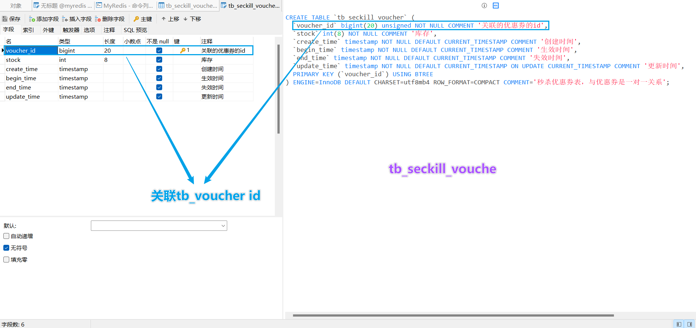


**SQL**

```MYSQL
# tb_voucher
CREATE TABLE `tb_voucher` (
  `id` bigint(20) unsigned NOT NULL AUTO_INCREMENT COMMENT '主键',
  `shop_id` bigint(20) unsigned DEFAULT NULL COMMENT '商铺id',
  `title` varchar(255) NOT NULL COMMENT '代金券标题',
  `sub_title` varchar(255) DEFAULT NULL COMMENT '副标题',
  `rules` varchar(1024) DEFAULT NULL COMMENT '使用规则',
  `pay_value` bigint(10) unsigned NOT NULL COMMENT '支付金额，单位是分。例如200代表2元',
  `actual_value` bigint(10) NOT NULL COMMENT '抵扣金额，单位是分。例如200代表2元',
  `type` tinyint(1) unsigned NOT NULL DEFAULT '0' COMMENT '0,普通券；1,秒杀券',
  `status` tinyint(1) unsigned NOT NULL DEFAULT '1' COMMENT '1,上架; 2,下架; 3,过期',
  `create_time` timestamp NOT NULL DEFAULT CURRENT_TIMESTAMP COMMENT '创建时间',
  `update_time` timestamp NOT NULL DEFAULT CURRENT_TIMESTAMP ON UPDATE CURRENT_TIMESTAMP COMMENT '更新时间',
  PRIMARY KEY (`id`) USING BTREE
) ENGINE=InnoDB AUTO_INCREMENT=10 DEFAULT CHARSET=utf8mb4 ROW_FORMAT=COMPACT;

# tb_seckill_voucher
CREATE TABLE `tb_seckill_voucher` (
  `voucher_id` bigint(20) unsigned NOT NULL COMMENT '关联的优惠券的id',
  `stock` int(8) NOT NULL COMMENT '库存',
  `create_time` timestamp NOT NULL DEFAULT CURRENT_TIMESTAMP COMMENT '创建时间',
  `begin_time` timestamp NOT NULL DEFAULT CURRENT_TIMESTAMP COMMENT '生效时间',
  `end_time` timestamp NOT NULL DEFAULT CURRENT_TIMESTAMP COMMENT '失效时间',
  `update_time` timestamp NOT NULL DEFAULT CURRENT_TIMESTAMP ON UPDATE CURRENT_TIMESTAMP COMMENT '更新时间',
  PRIMARY KEY (`voucher_id`) USING BTREE
) ENGINE=InnoDB DEFAULT CHARSET=utf8mb4 ROW_FORMAT=COMPACT COMMENT='秒杀优惠券表，与优惠券是一对一关系';
```


---


## 添加秒杀卷

VoucherController

```java
/**
 * 新增秒杀券
 * @param voucher 优惠券信息，包含秒杀信息
 * @return 优惠券id
 */
@PostMapping("seckill")
public Result addSeckillVoucher(@RequestBody Voucher voucher) {
    voucherService.addSeckillVoucher(voucher);
    return Result.ok(voucher.getId());
}
```

VoucherServiceImpl

```java
//也就是说 秒杀卷 也包含的普通卷的创建 
//这里调用的seckillVoucherService业务
@Override
@Transactional
public void addSeckillVoucher(Voucher voucher) {
    // 保存优惠券
    save(voucher);
    // 保存秒杀信息
    SeckillVoucher seckillVoucher = new SeckillVoucher();
    seckillVoucher.setVoucherId(voucher.getId());
    seckillVoucher.setStock(voucher.getStock());
    seckillVoucher.setBeginTime(voucher.getBeginTime());
    seckillVoucher.setEndTime(voucher.getEndTime());
    seckillVoucherService.save(seckillVoucher);
}
```


也就是说 秒杀卷 也包含的普通卷的创建


```http
POST	http://localhost:8081/voucher/seckill

{
    "shopId":1,
    "title":"100元代金券",
    "subTitle":"周一至周五均可使用",
    "rules":"全场通用\\n无需预约\n可无限叠加\\不兑现、不找零\\n仅限堂食",
    "payValue":8000,
    "actualValue":10000,
    "type":1,
    "stock":100,
    "beginTime":"2022-10-26T10:01:00",
    "endTime":"2022-10-31T23:01:00"
}
```


## 秒杀卷下单


库表设计：**tb_voucher_order**


```mysql
# tb_vouche_order
CREATE TABLE `tb_voucher_order` (
  `id` bigint(20) NOT NULL COMMENT '主键',
  `user_id` bigint(20) unsigned NOT NULL COMMENT '下单的用户id',
  `voucher_id` bigint(20) unsigned NOT NULL COMMENT '购买的代金券id',
  `pay_type` tinyint(1) unsigned NOT NULL DEFAULT '1' COMMENT '支付方式 1：余额支付；2：支付宝；3：微信',
  `status` tinyint(1) unsigned NOT NULL DEFAULT '1' COMMENT '订单状态，1：未支付；2：已支付；3：已核销；4：已取消；5：退款中；6：已退款',
  `create_time` timestamp NOT NULL DEFAULT CURRENT_TIMESTAMP COMMENT '下单时间',
  `pay_time` timestamp NULL DEFAULT NULL COMMENT '支付时间',
  `use_time` timestamp NULL DEFAULT NULL COMMENT '核销时间',
  `refund_time` timestamp NULL DEFAULT NULL COMMENT '退款时间',
  `update_time` timestamp NOT NULL DEFAULT CURRENT_TIMESTAMP ON UPDATE CURRENT_TIMESTAMP COMMENT '更新时间',
  PRIMARY KEY (`id`) USING BTREE
) ENGINE=InnoDB DEFAULT CHARSET=utf8mb4 ROW_FORMAT=COMPACT;
```


实体类：Voucher

```java
@Data
@EqualsAndHashCode(callSuper = false)
@Accessors(chain = true)
@TableName("tb_voucher")
public class Voucher implements Serializable {

    private static final long serialVersionUID = 1L;

    /**
     * 主键
     */
    @TableId(value = "id", type = IdType.AUTO)
    private Long id;

    /**
     * 商铺id
     */
    private Long shopId;

    /**
     * 代金券标题
     */
    private String title;

    /**
     * 副标题
     */
    private String subTitle;

    /**
     * 使用规则
     */
    private String rules;

    /**
     * 支付金额
     */
    private Long payValue;

    /**
     * 抵扣金额
     */
    private Long actualValue;

    /**
     * 优惠券类型
     */
    private Integer type;

    /**
     * 优惠券类型
     */
    private Integer status;
    /**
     * 库存
     */
    @TableField(exist = false)
    private Integer stock;

    /**
     * 生效时间
     */
    @TableField(exist = false)
    private LocalDateTime beginTime;

    /**
     * 失效时间
     */
    @TableField(exist = false)
    private LocalDateTime endTime;

    /**
     * 创建时间
     */
    private LocalDateTime createTime;


    /**
     * 更新时间
     */
    private LocalDateTime updateTime;


}
```


下单流程：


业务代码：

```java
package com.hmdp.service.impl;

import com.hmdp.dto.Result;
import com.hmdp.entity.SeckillVoucher;
import com.hmdp.entity.Voucher;
import com.hmdp.entity.VoucherOrder;
import com.hmdp.mapper.VoucherOrderMapper;
import com.hmdp.service.ISeckillVoucherService;
import com.hmdp.service.IVoucherOrderService;
import com.baomidou.mybatisplus.extension.service.impl.ServiceImpl;
import com.hmdp.service.IVoucherService;
import com.hmdp.utils.RedisIdWorker;
import com.hmdp.utils.UserHolder;
import org.springframework.stereotype.Service;
import org.springframework.transaction.annotation.Transactional;

import javax.annotation.Resource;
import java.time.LocalDateTime;


/**
 * <p>
 *  服务实现类
 * </p>
 *
 */
@Service
public class VoucherOrderServiceImpl extends ServiceImpl<VoucherOrderMapper, VoucherOrder> implements IVoucherOrderService {

    @Resource
    private ISeckillVoucherService iSeckillVoucherService;

    @Resource
    private RedisIdWorker redisIdWorker;

    /**
     * 实现订单秒杀业务
     * @param voucherId
     * @return
     */
    @Override
    @Transactional //添加上事务
    public Result seckillVoucher(Long voucherId) {
        //1.查询优惠卷信息
        SeckillVoucher voucher = iSeckillVoucherService.getById(voucherId);
        Integer stock = voucher.getStock();
        System.out.println(voucher);
        //2.判断优惠卷是否开始
        if (voucher.getBeginTime().isAfter(LocalDateTime.now())){
            //尚未开始，返回异常给前端
            return Result.fail("秒杀尚未开始！");
        }
        //3.判断优惠卷是否过期
        if (voucher.getEndTime().isBefore(LocalDateTime.now())){
            //秒杀已结束，返回前端异常信息
            return Result.fail("秒杀已结束！");
        }
        //4.判断优惠卷库存是否充足
        if (stock < 1){
            //秒杀卷库存不足，返回给前端异常信息
            return Result.fail("库存不足！");
        }
        //5.扣减库存
        boolean isOK = iSeckillVoucherService
                .update()
                .setSql("stock =stock - 1")
                .eq("voucher_id", voucherId)
                .update();
        if (!isOK){
            //秒杀失败，返回给前端异常信息
            return Result.fail("库存不足！");
        }
        //6.创建订单
        VoucherOrder voucherOrder = new VoucherOrder();
        //6.1.生成订单id
        long orderId = redisIdWorker.nextId("order");
        voucherOrder.setId(orderId);
        //6.2.设置用户id
        voucherOrder.setUserId(UserHolder.getUser().getId());
        //6.3.设置代金卷id
        voucherOrder.setVoucherId(voucherId);
        //6.4.当生产的订单id写入数据库
        this.save(voucherOrder);

        //7.返回订单ID
        return Result.ok(orderId);
    }

}
```

存在问题：

1. 【超卖问题】 并发情况下，会出现线程安全问题  【超卖问题】
2. 【一人一单】 一人可以下多单，应该是一人只能抢一个秒杀卷  【一人一单】


---


## 问题--超卖问题


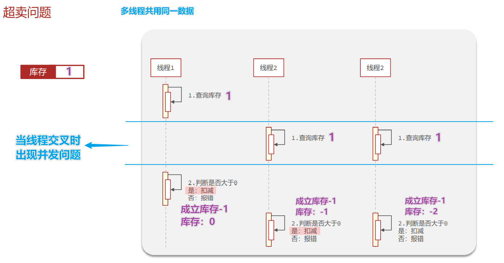

解决方案 ： 加锁

锁的选择：

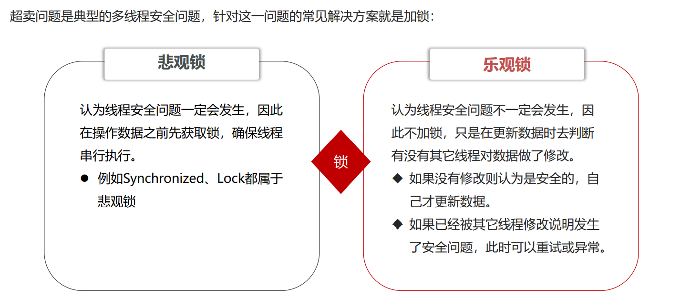


乐观锁：

版本号法


CAS法


超卖这样的线程安全问题，解决方案有哪些？

1. 悲观锁：添加同步锁，让线程串行执行

   • 优点：简单粗暴

   • 缺点：性能一般

2. 乐观锁：不加锁，在更新时判断是否有其它线程在修改

   • 优点：性能好

   • 缺点：存在成功率低的问题


解决问题：

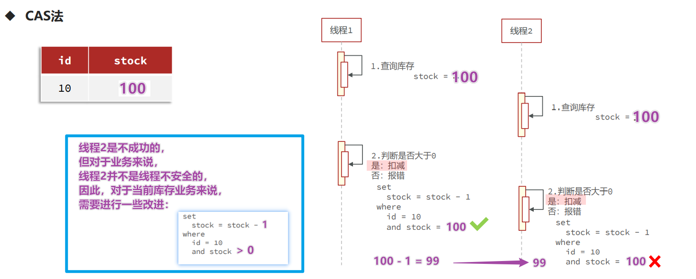


```java
package com.hmdp.service.impl;

import com.hmdp.dto.Result;
import com.hmdp.entity.SeckillVoucher;
import com.hmdp.entity.Voucher;
import com.hmdp.entity.VoucherOrder;
import com.hmdp.mapper.VoucherOrderMapper;
import com.hmdp.service.ISeckillVoucherService;
import com.hmdp.service.IVoucherOrderService;
import com.baomidou.mybatisplus.extension.service.impl.ServiceImpl;
import com.hmdp.service.IVoucherService;
import com.hmdp.utils.RedisIdWorker;
import com.hmdp.utils.UserHolder;
import org.springframework.stereotype.Service;
import org.springframework.transaction.annotation.Transactional;

import javax.annotation.Resource;
import java.time.LocalDateTime;


/**
 * <p>
 *  服务实现类
 * </p>
 *
 */
@Service
public class VoucherOrderServiceImpl extends ServiceImpl<VoucherOrderMapper, VoucherOrder> implements IVoucherOrderService {

    @Resource
    private ISeckillVoucherService iSeckillVoucherService;

    @Resource
    private RedisIdWorker redisIdWorker;

    /**
     * 实现订单秒杀业务
     * @param voucherId
     * @return
     */
    @Override
    @Transactional //添加上事务
    public Result seckillVoucher(Long voucherId) {
        //1.查询优惠卷信息
        SeckillVoucher voucher = iSeckillVoucherService.getById(voucherId);
        Integer stock = voucher.getStock();
        System.out.println(voucher);
        //2.判断优惠卷是否开始
        if (voucher.getBeginTime().isAfter(LocalDateTime.now())){
            //尚未开始，返回异常给前端
            return Result.fail("秒杀尚未开始！");
        }
        //3.判断优惠卷是否过期
        if (voucher.getEndTime().isBefore(LocalDateTime.now())){
            //秒杀已结束，返回前端异常信息
            return Result.fail("秒杀已结束！");
        }
        //4.判断优惠卷库存是否充足
        if (stock < 1){
            //秒杀卷库存不足，返回给前端异常信息
            return Result.fail("库存不足！");
        }
        //5.扣减库存
        boolean isOK = iSeckillVoucherService
                .update()
                .setSql("stock =stock - 1")
                .eq("voucher_id", voucherId)
                //.eq("stock",stock) // CAS乐观锁
                .gt("stock",0) 
            	// CAS乐观锁改进  stock > 0 就可以执行下单业务
                .update();
        if (!isOK){
            //秒杀失败，返回给前端异常信息
            return Result.fail("库存不足！");
        }
        //6.创建订单
        VoucherOrder voucherOrder = new VoucherOrder();
        //6.1.生成订单id
        long orderId = redisIdWorker.nextId("order");
        voucherOrder.setId(orderId);
        //6.2.设置用户id
        voucherOrder.setUserId(UserHolder.getUser().getId());
        //6.3.设置代金卷id
        voucherOrder.setVoucherId(voucherId);
        //6.4.当生产的订单id写入数据库
        this.save(voucherOrder);

        //7.返回订单ID
        return Result.ok(orderId);
    }

}
```


## 问题--一人一单


重点！！！！！！！

```Java
/**
几个重点：
1. 一人一单问题使用 悲观锁 还是 乐观锁？
     使用悲观锁
2. 使用悲观锁 synchronized 加载 方法上 还是 内部？
     内部，如果加载方法上，那整个订单业务都是串行，那刚刚解决的 超卖问题[乐观锁]也没意义了
3. synchronized 的锁对象是什么
     userId.toString().intern()
         而不是 userId.toString()
         Long的 toString() 底层是：
         return new String(buf, UTF16);
         .intern()方法是：返回字符串对象的规范表示。
4. 对于事务的添加 是 锁释放完了再提交 还是 提交完了再释放锁
     提交完了再释放锁
     具体操作：
         1.在方法上加上@Transactional
         2.在调用者 调用语句外加上 synchronized
            synchronized (userId.toString().intern()) {
                return queryOrderVoucherSave(voucherId);
            }
5. 事务失效问题
     spring的事务是 AOP动态代理的
         this.queryOrderVoucherSave(voucherId) //并非是代理对象
     解决方法
         这里使用 获取动态代理的方式 :
             //获取动态代理对象
             IVoucherOrderService proxy = (IVoucherOrderService) AopContext.currentProxy();
             //通过代理对象调用
             proxy.queryOrderVoucherSave(voucherId);
         注意: 使用AopContext.currentProxy()
                 导入aspectjweaver依赖
                 开启 @EnableAspectJAutoProxy(exposeProxy = true) 暴露代理对象
                 
*/
```


业务的实现

```java
@Override
public Result seckillVoucher(Long voucherId) {
    //1.查询优惠卷信息
    SeckillVoucher voucher = iSeckillVoucherService.getById(voucherId);
    Integer stock = voucher.getStock();
    System.out.println(voucher);
    //2.判断优惠卷是否开始
    if (voucher.getBeginTime().isAfter(LocalDateTime.now())) {
        //尚未开始，返回异常给前端
        return Result.fail("秒杀尚未开始！");
    }
    //3.判断优惠卷是否过期
    if (voucher.getEndTime().isBefore(LocalDateTime.now())) {
        //秒杀已结束，返回前端异常信息
        return Result.fail("秒杀已结束！");
    }
    //4.判断优惠卷库存是否充足
    if (stock < 1) {
        //秒杀卷库存不足，返回给前端异常信息
        return Result.fail("库存不足！");
    }


    //一人一单问题
    //获取用户id
    Long userId = UserHolder.getUser().getId();

    //缩小悲观锁范围
    synchronized (userId.toString().intern()) {
        //获取当前代理对象
        IVoucherOrderService proxy = (IVoucherOrderService) AopContext.currentProxy();
        //通过代理对象调用 保证事务的正常
        return proxy.queryOrderVoucherSave(voucherId);
    }

}


@Transactional
public Result queryOrderVoucherSave(Long voucherId) {

    //获取用户id
    Long userId = UserHolder.getUser().getId();

    //判断订单表中是否已经存在
    int count = query()
            .eq("user_id", userId)
            .eq("voucher_id", voucherId)
            .count();
    if (count > 0) {
        //存在，返回前端信息
        return Result.fail("你已领取，每人只能领取一份！");
    }

    //以上都满足 施行扣减下单业务
    //5.扣减库存
    boolean isOK = iSeckillVoucherService
            .update()
            .setSql("stock =stock - 1")
            .eq("voucher_id", voucherId)
            //.eq("stock",stock) // CAS乐观锁
            // CAS乐观锁改进  stock > 0 就可以执行下单业务
            .gt("stock", 0)
            .update();
    if (!isOK) {
        //秒杀失败，返回给前端异常信息
        return Result.fail("库存不足！");
    }
    //6.创建订单
    VoucherOrder voucherOrder = new VoucherOrder();
    //6.1.生成订单id
    long orderId = redisIdWorker.nextId("order");
    voucherOrder.setId(orderId);
    //6.2.设置用户id
    voucherOrder.setUserId(userId);
    //6.3.设置代金卷id
    voucherOrder.setVoucherId(voucherId);
    //6.4.当生产的订单id写入数据库
    this.save(voucherOrder);

    //7.返回订单ID
    return Result.ok(orderId);


}
```

暴露代理对象

```xml
<dependency>
    <groupId>org.aspectj</groupId>
    <artifactId>aspectjweaver</artifactId>
    <version>1.9.9.1</version>
</dependency>
```

```java
//暴露动态代理
@EnableAspectJAutoProxy(exposeProxy = true)
@MapperScan("com.hmdp.mapper")
@SpringBootApplication
public class SeckillVouchersApp {
    public static void main(String[] args) {
        SpringApplication.run(SeckillVouchersApp.class, args);
    }
}
```


## 以上依然存在问题！


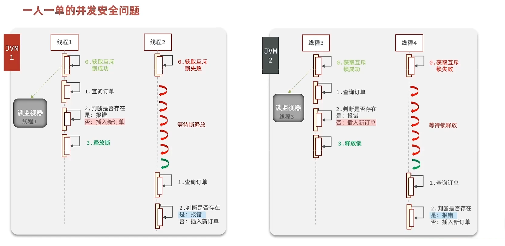


在集群 或 分布式系统下 ， 每个JVM的锁监视器是独立的，就会出现并发安全问题

解决方案：使用 分布式锁

下面👇


---

# 分布式锁


## 分布式锁

什么是分布式锁

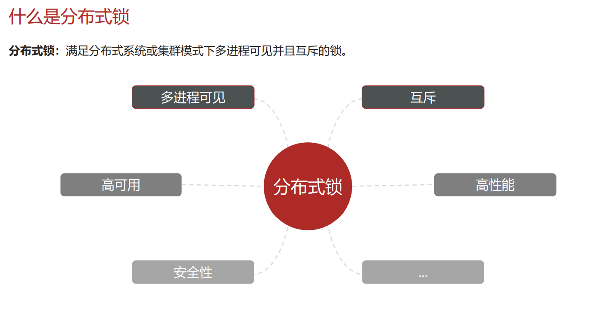

分布式锁的实现


## 基于Redis的分布式锁


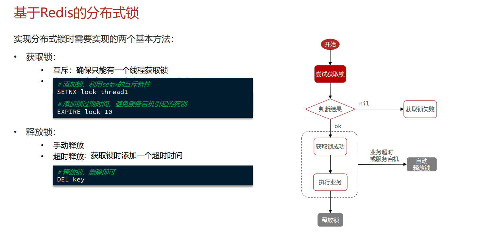


### 一个简单的实现：

```java
/**
 * 基于Redis的分布式锁
 */
public interface ILock {

    /**
     * 尝试获取锁
     * @param timeoutSec 兜底过期时间
     * @return 获取是否成功 true成功
     */
    boolean tryLock(long timeoutSec);

    /**
     * 释放锁
     */
    void unLock();

}
```

impl

```java
package com.hmdp.utils;

import cn.hutool.core.lang.UUID;
import cn.hutool.core.util.BooleanUtil;
import org.springframework.data.redis.core.StringRedisTemplate;

import java.util.concurrent.TimeUnit;

public class LockImpl implements ILock{

    /**
     * redis
     */
    private StringRedisTemplate stringRedisTemplate;
    /**
     * 锁名称
     */
    private String name;
    public LockImpl(StringRedisTemplate stringRedisTemplate, String name) {
        this.stringRedisTemplate = stringRedisTemplate;
        this.name = name;
    }

    /**
     * 锁前缀
     */
    private static final String KEY_PREFIX = "lock:";

    /**
     * 锁的唯一标识
     */
    private String ID_PREFIX = UUID.randomUUID().toString(true);

    /**
     * 尝试获取锁
     * @param timeoutSec 兜底过期时间
     * @return 获取是否成功 true成功
     */
    @Override
    public boolean tryLock(long timeoutSec) {
        // 锁的唯一标识：这里用 UUID + 线程id
        String value = ID_PREFIX + Thread.currentThread().getId();
        // 获取锁的 key
        String key = KEY_PREFIX + name;

        //尝试获取锁
        Boolean isLock = stringRedisTemplate
                .opsForValue()
                .setIfAbsent(key, value, timeoutSec, TimeUnit.SECONDS);

        //返回结果
        //return Boolean.TRUE.equals(isLock); //或者 👇
        return BooleanUtil.isTrue(isLock);
    }


    /**
     * 释放锁
     */
    @Override
    public void unLock() {
        //释放锁
        Boolean delete = stringRedisTemplate.delete(KEY_PREFIX + name);
    }

}
```

业务：

```java
package com.hmdp.service.impl;

import com.hmdp.dto.Result;
import com.hmdp.entity.SeckillVoucher;
import com.hmdp.entity.VoucherOrder;
import com.hmdp.mapper.VoucherOrderMapper;
import com.hmdp.service.ISeckillVoucherService;
import com.hmdp.service.IVoucherOrderService;
import com.baomidou.mybatisplus.extension.service.impl.ServiceImpl;
import com.hmdp.utils.LockImpl;
import com.hmdp.utils.RedisIdWorker;
import com.hmdp.utils.UserHolder;
import org.springframework.aop.framework.AopContext;
import org.springframework.data.redis.core.StringRedisTemplate;
import org.springframework.stereotype.Service;
import org.springframework.transaction.annotation.Transactional;

import javax.annotation.Resource;
import java.time.LocalDateTime;


/**
 * <p>
 * 服务实现类
 * </p>
 */
@Service
public class VoucherOrderServiceImpl extends ServiceImpl<VoucherOrderMapper, VoucherOrder> implements IVoucherOrderService {

    @Resource
    private ISeckillVoucherService iSeckillVoucherService;

    @Resource
    private RedisIdWorker redisIdWorker;

    @Resource
    private StringRedisTemplate stringRedisTemplate;

    /**
     * 实现订单秒杀业务
     *
     * @param voucherId
     * @return
     */
    @Override
    public Result seckillVoucher(Long voucherId) {
        //1.查询优惠卷信息
        SeckillVoucher voucher = iSeckillVoucherService.getById(voucherId);
        Integer stock = voucher.getStock();
        System.out.println(voucher);
        //2.判断优惠卷是否开始
        if (voucher.getBeginTime().isAfter(LocalDateTime.now())) {
            //尚未开始，返回异常给前端
            return Result.fail("秒杀尚未开始！");
        }
        //3.判断优惠卷是否过期
        if (voucher.getEndTime().isBefore(LocalDateTime.now())) {
            //秒杀已结束，返回前端异常信息
            return Result.fail("秒杀已结束！");
        }
        //4.判断优惠卷库存是否充足
        if (stock < 1) {
            //秒杀卷库存不足，返回给前端异常信息
            return Result.fail("库存不足！");
        }


        //一人一单问题
        //获取用户id
        Long userId = UserHolder.getUser().getId();

        //缩小悲观锁范围
        /*synchronized (userId.toString().intern()) {
            //获取当前代理对象
            IVoucherOrderService proxy = (IVoucherOrderService) AopContext.currentProxy();
            //通过代理对象调用 保证事务的正常
            return proxy.queryOrderVoucherSave(voucherId);
        }*/

        //获取分布式锁对象
        LockImpl lock = new LockImpl(stringRedisTemplate,"order:" + userId);
        //尝试获取锁
        boolean isLock = lock.tryLock(1200);
        //判断是否获取成功
        if (!isLock){
            //获取锁失败
            return Result.fail("不能重复下单！");
        }
        //成功 执行业务
        try{
            //获取当前代理对象
            IVoucherOrderService proxy = (IVoucherOrderService) AopContext.currentProxy();
            //通过代理对象调用 保证事务的正常
            return proxy.queryOrderVoucherSave(voucherId);
        }finally{
            //确保锁的释放
            lock.unLock();
        }


    }


    /**
     *<br> 几个重点：
     *<br> 1. 一人一单问题使用 悲观锁 还是 乐观锁？
     *<br>      使用悲观锁
     *<br> 2. 使用悲观锁 synchronized 加载 方法上 还是 内部？
     *<br>      内部，如果加载方法上，那整个订单业务都是串行，那刚刚解决的 超卖问题[乐观锁]也没意义了
     *<br> 3. synchronized 的锁对象是什么
     *<br>      userId.toString().intern()
     *<br>          而不是 userId.toString()
     *<br>          Long的 toString() 底层是：
     *<br>          return new String(buf, UTF16);
     *<br>          .intern()方法是：返回字符串对象的规范表示。
     *<br> 4. 对于事务的添加 是 锁释放完了再提交 还是 提交完了再释放锁
     *<br>      提交完了再释放锁
     *<br>      具体操作：
     *<br>          1.在方法上加上@Transactional
     *<br>          2.在调用者 调用语句外加上 synchronized
     *<br>             synchronized (userId.toString().intern()) {
     *<br>                 return queryOrderVoucherSave(voucherId);
     *<br>             }
     *<br> 5. 事务失效问题
     *<br>      spring的事务是 AOP动态代理的
     *<br>          this.queryOrderVoucherSave(voucherId) //并非是代理对象
     *<br>      解决方法
     *<br>          这里使用 获取动态代理的方式 :
     *<br>              //获取动态代理对象
     *<br>              IVoucherOrderService proxy = (IVoucherOrderService) AopContext.currentProxy();
     *<br>              //通过代理对象调用
     *<br>              proxy.queryOrderVoucherSave(voucherId);
     *<br>          注意: 使用AopContext.currentProxy()
     *<br>                  导入aspectjweaver依赖
     *<br>                  开启 @EnableAspectJAutoProxy(exposeProxy = true) 暴露代理对象
     *<br>
     *<br> @param voucherId
     *<br> @return
     */
    @Transactional
    public Result queryOrderVoucherSave(Long voucherId) {

        //获取用户id
        Long userId = UserHolder.getUser().getId();

        //判断订单表中是否已经存在
        int count = query()
                .eq("user_id", userId)
                .eq("voucher_id", voucherId)
                .count();
        if (count > 0) {
            //存在，返回前端信息
            return Result.fail("你已领取，每人只能领取一份！");
        }

        //以上都满足 施行扣减下单业务
        //5.扣减库存
        boolean isOK = iSeckillVoucherService
                .update()
                .setSql("stock =stock - 1")
                .eq("voucher_id", voucherId)
                //.eq("stock",stock) // CAS乐观锁
                // CAS乐观锁改进  stock > 0 就可以执行下单业务
                .gt("stock", 0)
                .update();
        if (!isOK) {
            //秒杀失败，返回给前端异常信息
            return Result.fail("库存不足！");
        }
        //6.创建订单
        VoucherOrder voucherOrder = new VoucherOrder();
        //6.1.生成订单id
        long orderId = redisIdWorker.nextId("order");
        voucherOrder.setId(orderId);
        //6.2.设置用户id
        voucherOrder.setUserId(userId);
        //6.3.设置代金卷id
        voucherOrder.setVoucherId(voucherId);
        //6.4.当生产的订单id写入数据库
        this.save(voucherOrder);

        //7.返回订单ID
        return Result.ok(orderId);

    }


}
```


### 存在的问题：误删问题

上面的简单实现

在正常情况下：


极端情况下：


解决方案：

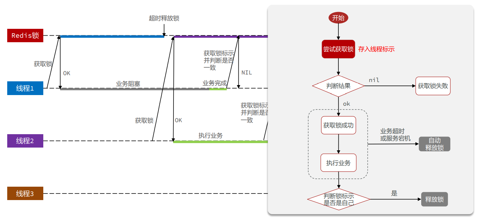

对 上面代码优化：

impl

```java
package com.hmdp.utils;

import cn.hutool.core.lang.UUID;
import cn.hutool.core.util.BooleanUtil;
import org.springframework.data.redis.core.StringRedisTemplate;

import java.util.concurrent.TimeUnit;

public class LockImpl implements ILock{

    /**
     * redis
     */
    private StringRedisTemplate stringRedisTemplate;
    /**
     * 锁名称
     */
    private String name;
    public LockImpl(StringRedisTemplate stringRedisTemplate, String name) {
        this.stringRedisTemplate = stringRedisTemplate;
        this.name = name;
    }

    /**
     * 锁前缀
     */
    private static final String KEY_PREFIX = "lock:";

    /**
     * 锁的唯一标识
     */
    private String ID_PREFIX = UUID.randomUUID().toString(true);

    /**
     * 尝试获取锁
     * @param timeoutSec 兜底过期时间
     * @return 获取是否成功 true成功
     */
    @Override
    public boolean tryLock(long timeoutSec) {
        // 锁的唯一标识：这里用 UUID + 线程id
        String value = ID_PREFIX + Thread.currentThread().getId();
        // 获取锁的 key
        String key = KEY_PREFIX + name;

        //尝试获取锁
        Boolean isLock = stringRedisTemplate
                .opsForValue()
                .setIfAbsent(key, value, timeoutSec, TimeUnit.SECONDS);

        //返回结果
        //return Boolean.TRUE.equals(isLock); //或者 👇
        return BooleanUtil.isTrue(isLock);
    }


    /**
     * 释放锁
     */
    @Override
    public void unLock() {

        //判断将要释放的锁 的 线程表示是否一致 解决分布式锁误删问题

        //锁的唯一标识：这里用 UUID + 线程id
        String value = ID_PREFIX + Thread.currentThread().getId();
        //获取锁的 key
        String key = KEY_PREFIX + name;
        //获取锁的标识
        String value2 = stringRedisTemplate.opsForValue().get(key);

        //判断将要释放的锁 的 线程表示是否一致 解决分布式锁误删问题
        if (value.equals(value2)){
            //释放锁
            stringRedisTemplate.delete(key);
        }
        //否则 不释放锁
    }

}

```


### 依然存在问题：原子性

删除锁时 判断锁的标识 和 释放锁 并发问题

极端情况下：

判断锁的标识 后 发生阻塞，超时释放了锁，此时其它线程获取锁，那么这个线程释放的锁 就是 其他线程的锁了

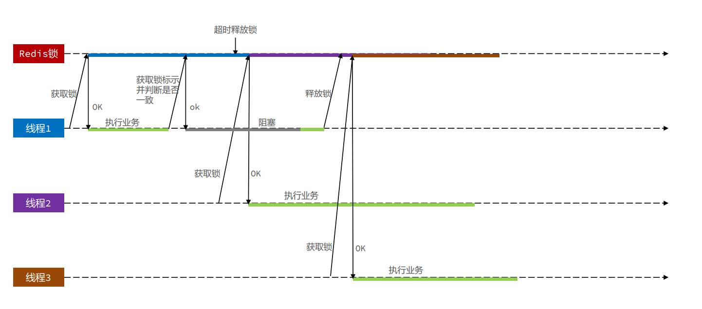

改进方案：

1. Redis的事务功能：麻烦不用
2. Redis的Lua脚本


**Redis的Lua脚本**

> Redis提供了Lua脚本功能，在一个脚本中编写多条Redis命令，确保多条命令执行时的原子性。Lua是一种 编程语言，它的基本语法大家可以参考网站：https://www.runoob.com/lua/lua-tutorial.html 这里重点介绍Redis提供的调用函数，语法如下：
>
> ```LUA
> # 执行redis命令
> redis.call('命令名称', 'key', '其它参数', ...)
> ```
>
> 例如，我们要执行set name jack，则脚本是这样：
>
> ```LUA
> # 执行 set name jack
> redis.call('set', 'name', 'jack')
> ```
>
> 例如，我们要先执行set name Rose，再执行get name，则脚本如下：
>
> ```LUA
>  先执行 set name jack
> redis.call('set', 'name', 'jack')
> # 再执行 get name
> local name = redis.call('get', 'name')
> # 返回
> return name
> ```
>
>


**Redis的Lua脚本的执行**

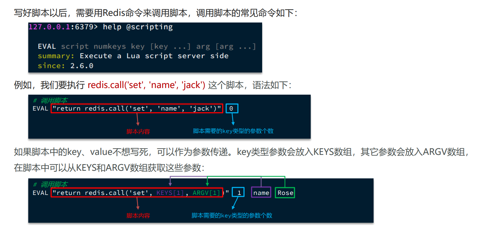


释放锁的业务流程是这样的：

1. 获取锁中的线程标示

2. 判断是否与指定的标示（当前线程标示）一致

3. 如果一致则释放锁（删除）

4. 如果不一致则什么都不做 如果用Lua脚本来表示则是这样的：

   ```lua
   -- 这里的 KEYS[1] 就是锁的key，这里的ARGV[1] 就是当前线程标示
   -- 获取锁中的标示，判断是否与当前线程标示一致
   if (redis.call('GET', KEYS[1]) == ARGV[1]) then
   -- 一致，则删除锁
   return redis.call('DEL', KEYS[1])
   end
   -- 不一致，则直接返回
   return 0
   ```


对之前的impl进行优化：

resources/unlock.lua

```lua
-- 这里的 KEYS[1] 就是锁的key，这里的ARGV[1] 就是当前线程标示
-- 获取锁中的标示，判断是否与当前线程标示一致

if (redis.call('GET', KEYS[1]) == ARGV[1]) then
    -- 一致，则删除锁
    return redis.call('DEL', KEYS[1])
end

-- 不一致，则直接返回
return 0
```

impl

```java
package com.hmdp.utils;

import cn.hutool.core.lang.UUID;
import cn.hutool.core.util.BooleanUtil;
import org.springframework.core.io.ClassPathResource;
import org.springframework.data.redis.core.RedisCallback;
import org.springframework.data.redis.core.StringRedisTemplate;
import org.springframework.data.redis.core.script.DefaultRedisScript;

import java.util.Collections;
import java.util.concurrent.TimeUnit;

public class LockImpl implements ILock{

    /**
     * redis
     */
    private StringRedisTemplate stringRedisTemplate;
    /**
     * 锁名称
     */
    private String name;
    public LockImpl(StringRedisTemplate stringRedisTemplate, String name) {
        this.stringRedisTemplate = stringRedisTemplate;
        this.name = name;
    }

    /**
     * 锁前缀
     */
    private static final String KEY_PREFIX = "lock:";

    /**
     * 锁的唯一标识
     */
    private String ID_PREFIX = UUID.randomUUID().toString(true);

    /**
     * 初始化Lua脚本对象   RedisScript的实现类
     */
    private static final  DefaultRedisScript<Long> UNLOCK_SCRIPT;
    static {
        //创建 RedisScript的实现类 DefaultRedisScript
        UNLOCK_SCRIPT = new DefaultRedisScript<Long>();
        //设置Lua脚本位置
        UNLOCK_SCRIPT.setLocation(new ClassPathResource("unlock.lua"));
        //设置脚本执行后的返回值类型
        UNLOCK_SCRIPT.setResultType(Long.class);
    }


    /**
     * 尝试获取锁
     * @param timeoutSec 兜底过期时间
     * @return 获取是否成功 true成功
     */
    @Override
    public boolean tryLock(long timeoutSec) {
        // 锁的唯一标识：这里用 UUID + 线程id
        String value = ID_PREFIX + Thread.currentThread().getId();
        // 获取锁的 key
        String key = KEY_PREFIX + name;

        //尝试获取锁
        Boolean isLock = stringRedisTemplate
                .opsForValue()
                .setIfAbsent(key, value, timeoutSec, TimeUnit.SECONDS);

        //返回结果
        //return Boolean.TRUE.equals(isLock); //或者 👇
        return BooleanUtil.isTrue(isLock);
    }


    /**
     * 释放锁
     */
    @Override
    public void unLock() {

        //判断将要释放的锁 的 线程表示是否一致 解决分布式锁误删问题

        //锁的唯一标识：这里用 UUID + 线程id
        String value = ID_PREFIX + Thread.currentThread().getId();
        //获取锁的 key
        String key = KEY_PREFIX + name;

        //判断将要释放的锁 的 线程表示是否一致 解决分布式锁误删问题
        //使用Lua脚本 确保 [判断标识] 和 [释放锁] 的 原子性
        stringRedisTemplate
                .execute(UNLOCK_SCRIPT, //Lua脚本对象
                         Collections.singletonList(key), //KEYS[1] list
                         value); //ARGV[1] object

        //否则 不释放锁
    }


}

```


到此 实现了一个较为完善的 基于Redis的分布式锁

但是.......在某些场景下 依然需要优化.......


---


### 基于Redis的分布式锁优化

---

还有些问题可以进一步优化：


这些实现起来比较繁琐

可以使用开源框架去解决：

**使用 Redisson **👇

---


## Redisson解决Redis分布式锁


### Redisson介绍

---


Redisson Redisson是一个在Redis的基础上实现的Java驻内存数据网格（In-Memory Data Grid）。

它不仅提供了一系列的分布 式的Java常用对象，还提供了许多分布式服务，其中就包含了各种分布式锁的实现。


官网地址： https://redisson.org

GitHub地址： https://github.com/redisson/redisson


简单的使用

```java
package com.hmdp.config;

import org.redisson.Redisson;
import org.redisson.api.RedissonClient;
import org.redisson.config.Config;
import org.springframework.context.annotation.Bean;
import org.springframework.context.annotation.Configuration;


/**
 * Redisson 初始化配置
 */
@Configuration
public class RedissonConfig {

    @Bean
    public RedissonClient redissonClient1() {

        Config config = new Config();
        //链接Redis
        config.useSingleServer()
                .setAddress("redis://ayaka520:6379")
                .setPassword("gangajiang521");
	    //解耦合 可以使用yaml的方式 解耦合
        //通过Redisson.create(config) 指定配置文件 创建RedissonClient
        return Redisson.create(config);
    }

    //@Bean
    public RedissonClient redissonClient2() {
        Config config = new Config();
        config.useSingleServer().setAddress("redis://ayaka521:6380");
        return Redisson.create(config);
    }

    //@Bean
    public RedissonClient redissonClient3() {
        Config config = new Config();
        config.useSingleServer()
                .setAddress("redis://ayaka521:6381");
        return Redisson.create(config);
    }

}
```

业务改造

```java
package com.hmdp.service.impl;

import com.hmdp.dto.Result;
import com.hmdp.entity.SeckillVoucher;
import com.hmdp.entity.VoucherOrder;
import com.hmdp.mapper.VoucherOrderMapper;
import com.hmdp.service.ISeckillVoucherService;
import com.hmdp.service.IVoucherOrderService;
import com.baomidou.mybatisplus.extension.service.impl.ServiceImpl;
import com.hmdp.utils.RedisIdWorker;
import com.hmdp.utils.UserHolder;
import org.redisson.api.RLock;
import org.redisson.api.RedissonClient;
import org.springframework.aop.framework.AopContext;
import org.springframework.stereotype.Service;
import org.springframework.transaction.annotation.Transactional;

import javax.annotation.Resource;
import java.time.LocalDateTime;


/**
 * <p>
 * 服务实现类
 * </p>
 */
@Service
public class VoucherOrderServiceImpl extends ServiceImpl<VoucherOrderMapper, VoucherOrder> implements IVoucherOrderService {

    @Resource
    private ISeckillVoucherService iSeckillVoucherService;

    @Resource
    private RedisIdWorker redisIdWorker;

    //@Resource
    //private StringRedisTemplate stringRedisTemplate;

    /**
     * Redisson
     */
    @Resource
    private RedissonClient redissonClient;

    /**
     * 实现订单秒杀业务
     *
     * @param voucherId
     * @return
     */
    @Override
    public Result seckillVoucher(Long voucherId) {
        //1.查询优惠卷信息
        SeckillVoucher voucher = iSeckillVoucherService.getById(voucherId);
        Integer stock = voucher.getStock();
        //2.判断优惠卷是否开始
        if (voucher.getBeginTime().isAfter(LocalDateTime.now())) {
            //尚未开始，返回异常给前端
            return Result.fail("秒杀尚未开始！");
        }
        //3.判断优惠卷是否过期
        if (voucher.getEndTime().isBefore(LocalDateTime.now())) {
            //秒杀已结束，返回前端异常信息
            return Result.fail("秒杀已结束！");
        }
        //4.判断优惠卷库存是否充足
        if (stock < 1) {
            //秒杀卷库存不足，返回给前端异常信息
            return Result.fail("库存不足！");
        }


        //一人一单问题
        //获取用户id
        Long userId = UserHolder.getUser().getId();

        //缩小悲观锁范围
        /*synchronized (userId.toString().intern()) {
            //获取当前代理对象
            IVoucherOrderService proxy = (IVoucherOrderService) AopContext.currentProxy();
            //通过代理对象调用 保证事务的正常
            return proxy.queryOrderVoucherSave(voucherId);
        }*/

        //获取分布式锁对象
        //LockImpl lock = new LockImpl(stringRedisTemplate,"order:" + userId);

        //从Redisson中获取锁
        RLock lock = redissonClient.getLock("lock:order:" + userId);

        //尝试获取锁
        boolean isLock = lock.tryLock();

        //判断是否获取成功
        if (!isLock){
            //获取锁失败
            return Result.fail("不能重复下单！");
        }
        //成功 执行业务
        try{
            //获取当前代理对象
            IVoucherOrderService proxy = (IVoucherOrderService) AopContext.currentProxy();
            //通过代理对象调用 保证事务的正常
            return proxy.queryOrderVoucherSave(voucherId);
        }finally{
            //确保锁的释放
            lock.unlock();
        }
    }

    @Transactional
    public Result queryOrderVoucherSave(Long voucherId) {

        //获取用户id
        Long userId = UserHolder.getUser().getId();

        //判断订单表中是否已经存在
        int count = query()
                .eq("user_id", userId)
                .eq("voucher_id", voucherId)
                .count();
        if (count > 0) {
            //存在，返回前端信息
            return Result.fail("你已领取，每人只能领取一份！");
        }

        //以上都满足 施行扣减下单业务
        //5.扣减库存
        boolean isOK = iSeckillVoucherService
                .update()
                .setSql("stock =stock - 1")
                .eq("voucher_id", voucherId)
                //.eq("stock",stock) // CAS乐观锁
                // CAS乐观锁改进  stock > 0 就可以执行下单业务
                .gt("stock", 0)
                .update();
        if (!isOK) {
            //秒杀失败，返回给前端异常信息
            return Result.fail("库存不足！");
        }
        //6.创建订单
        VoucherOrder voucherOrder = new VoucherOrder();
        //6.1.生成订单id
        long orderId = redisIdWorker.nextId("order");
        voucherOrder.setId(orderId);
        //6.2.设置用户id
        voucherOrder.setUserId(userId);
        //6.3.设置代金卷id
        voucherOrder.setVoucherId(voucherId);
        //6.4.当生产的订单id写入数据库
        this.save(voucherOrder);

        //7.返回订单ID
        return Result.ok(orderId);

    }


}
```


### Redisson可重入锁问题


**原理：**

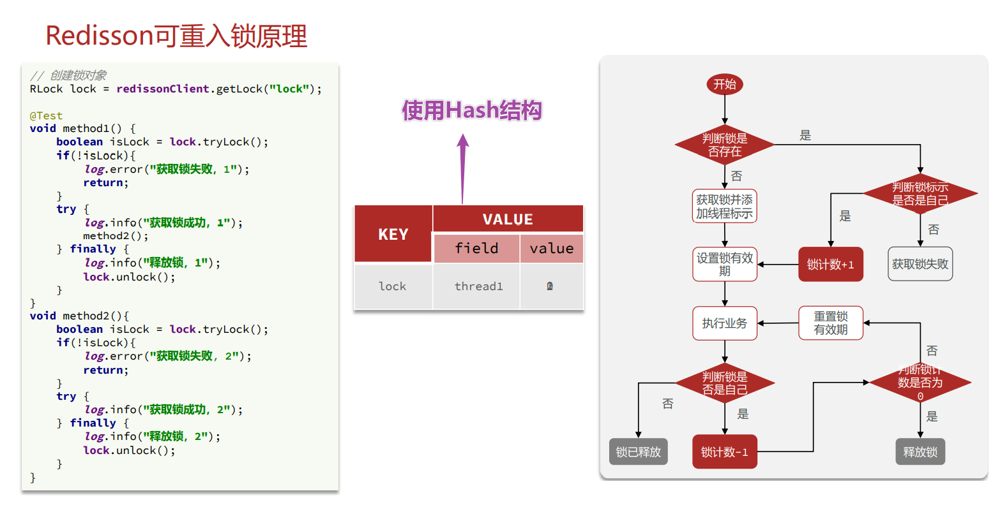


---

**使用Lua脚本实现 --- 获取锁**

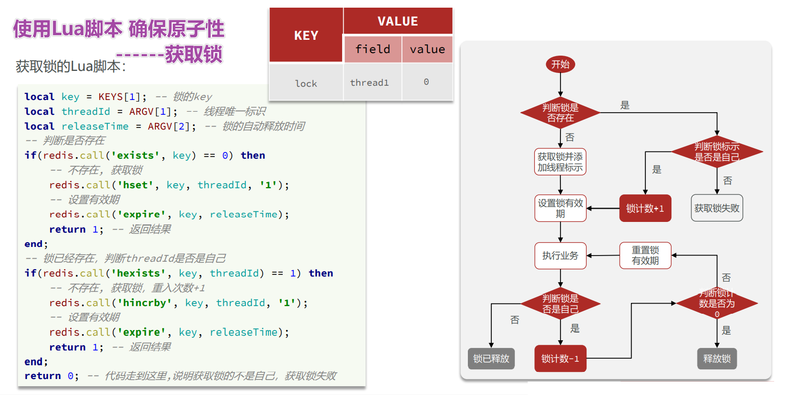

源码：

```java
<T> RFuture<T> tryLockInnerAsync(long waitTime, long leaseTime, TimeUnit unit, long threadId, RedisStrictCommand<T> command) {
    return evalWriteAsync(getRawName(), LongCodec.INSTANCE, command,
            "if (redis.call('exists', KEYS[1]) == 0) then " +
                    "redis.call('hincrby', KEYS[1], ARGV[2], 1); " +
                    "redis.call('pexpire', KEYS[1], ARGV[1]); " +
                    "return nil; " +
                    "end; " +
                    "if (redis.call('hexists', KEYS[1], ARGV[2]) == 1) then " +
                    "redis.call('hincrby', KEYS[1], ARGV[2], 1); " +
                    "redis.call('pexpire', KEYS[1], ARGV[1]); " +
                    "return nil; " +
                    "end; " +
                    "return redis.call('pttl', KEYS[1]);",
            Collections.singletonList(getRawName()), unit.toMillis(leaseTime), getLockName(threadId));
}
```


---

**使用Lua脚本实现 --- 释放锁**

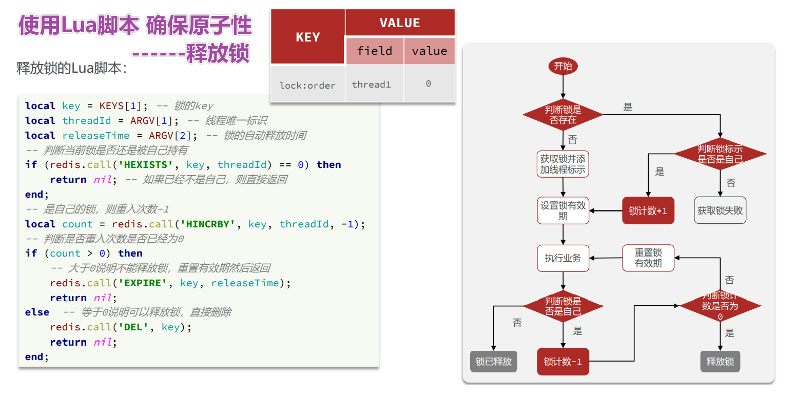

源码：

```java
protected RFuture<Boolean> unlockInnerAsync(long threadId) {
    return evalWriteAsync(getRawName(), LongCodec.INSTANCE, RedisCommands.EVAL_BOOLEAN,
            "if (redis.call('hexists', KEYS[1], ARGV[3]) == 0) then " +
                    "return nil;" +
                    "end; " +
                    "local counter = redis.call('hincrby', KEYS[1], ARGV[3], -1); " +
                    "if (counter > 0) then " +
                    "redis.call('pexpire', KEYS[1], ARGV[2]); " +
                    "return 0; " +
                    "else " +
                    "redis.call('del', KEYS[1]); " +
                    "redis.call('publish', KEYS[2], ARGV[1]); " +
                    "return 1; " +
                    "end; " +
                    "return nil;",
            Arrays.asList(getRawName(), getChannelName()), LockPubSub.UNLOCK_MESSAGE, internalLockLeaseTime, getLockName(threadId));
}
```


### 可重试--WatchDog机制

---

源码jiji看 jiji分析


### 超时释放--发布订阅/信号量

---

源码jiji看 jiji分析


### Redisson分布式锁的原理

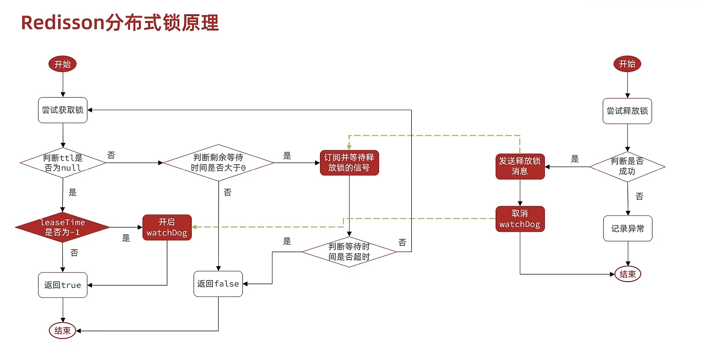


Redisson分布式锁原理：

- 可重入：利用hash结构记录线程id和重入次数
- 可重试：利用信号量和PubSub功能实现等待、唤醒，获取 锁失败的重试机制
- 超时续约：利用watchDog，每隔一段时间（releaseTime  / 3），重置超时时间


---

---


### Redisson主从一致性问题

---


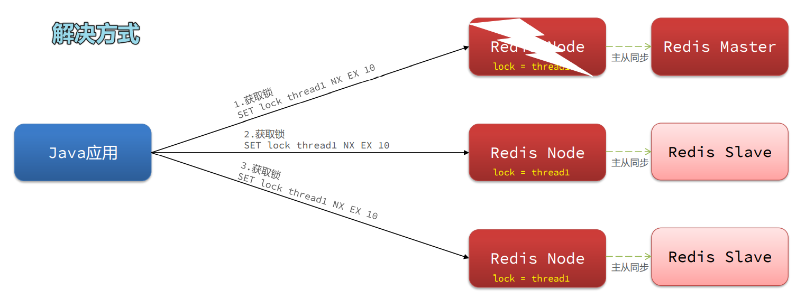

**使用:**

RedissonConfig

```java
package com.hmdp.config;

import org.redisson.Redisson;
import org.redisson.api.RedissonClient;
import org.redisson.config.Config;
import org.springframework.context.annotation.Bean;
import org.springframework.context.annotation.Configuration;

import java.io.IOException;

/**
 * Redisson 初始化配置
 */
@Configuration
public class RedissonConfig {

    @Bean
    public RedissonClient redissonClient1() throws IOException {

        Config config = new Config();
        //链接Redis
        config.useSingleServer()
                .setAddress("redis://ayaka520:6379")
                .setPassword("gangajiang521");

        //通过Redisson.create(config) 指定配置文件 创建RedissonClient
        return Redisson.create(config);
    }

    @Bean
    public RedissonClient redissonClient2() throws IOException {
        Config config = new Config();
        config.useSingleServer().setAddress("redis://ayaka521:6380");
        return Redisson.create(config);
    }

    @Bean
    public RedissonClient redissonClient3() throws IOException {
        Config config = new Config();
        config.useSingleServer()
                .setAddress("redis://ayaka521:6381");
        return Redisson.create(config);
    }


}
```

RedissonTests

```java
package com.hmdp;

import lombok.extern.slf4j.Slf4j;
import org.junit.jupiter.api.BeforeEach;
import org.junit.jupiter.api.Test;
import org.redisson.api.RLock;
import org.redisson.api.RedissonClient;
import org.springframework.boot.test.context.SpringBootTest;

import javax.annotation.Resource;
import java.util.concurrent.TimeUnit;

@Slf4j
@SpringBootTest
class RedissonTest {

    @Resource
    private RedissonClient redissonClient1;

    @Resource
    private RedissonClient redissonClient2;

    @Resource
    private RedissonClient redissonClient3;

    
    private RLock lock;
    //创建连锁
    @BeforeEach
    void setUp() {
        //获取 RLock对象
        RLock lock1 = redissonClient1.getLock("lock:test");
        RLock lock2 = redissonClient2.getLock("lock:test");
        RLock lock3 = redissonClient3.getLock("lock:test");
        //创建连锁
        lock = redissonClient1.getMultiLock(lock1,lock2,lock3);
    }


    @Test
    void method1() throws InterruptedException {
        // 尝试获取锁
        boolean isLock = lock.tryLock(1L, TimeUnit.SECONDS);
        if (!isLock) {
            log.error("获取锁失败 .... 1");
            return;
        }
        try {
            log.info("获取锁成功 .... 1");
            method2();
            log.info("开始执行业务 ... 1");
        } finally {
            log.warn("准备释放锁 .... 1");
            lock.unlock();
        }
    }
    void method2() {
        // 尝试获取锁
        boolean isLock = lock.tryLock();
        if (!isLock) {
            log.error("获取锁失败 .... 2");
            return;
        }
        try {
            log.info("获取锁成功 .... 2");
            log.info("开始执行业务 ... 2");
        } finally {
            log.warn("准备释放锁 .... 2");
            lock.unlock();
        }
    }
}
```


---


### 总结

---

> ## 总结
>
> 1）不可重入Redis分布式锁：
>
> - 原理：利用setnx的互斥性；利用ex避免死锁；释放锁时判 断线程标示
>
> - 缺陷：不可重入、无法重试、锁超时失效
>
>
>
> 2）可重入的Redis分布式锁：
>
> - 原理：利用hash结构，记录线程标示和重入次数；利用 watchDog延续锁时间；利用>信号量控制锁重试等待
>
> - 缺陷：redis宕机引起锁失效问题
>
> 
>
>
>
>
>
> 3）Redisson的multiLock：
>
> - 原理：多个独立的Redis节点，必须在所有节点都获取重入锁，才算获取锁成功
> - 缺陷：运维成本高、实现复杂
>
>
>
> 
>
>


这样就就觉了分布式锁的问题

但是，还可以继续优化：

---


# 基于Redis的消息队列

---


## 秒杀业务的优化


改进方案：

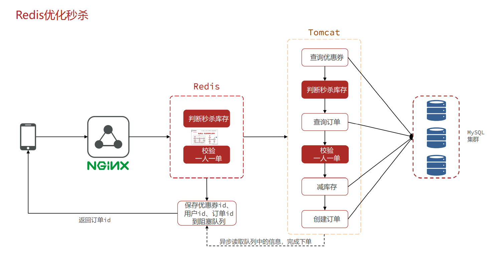


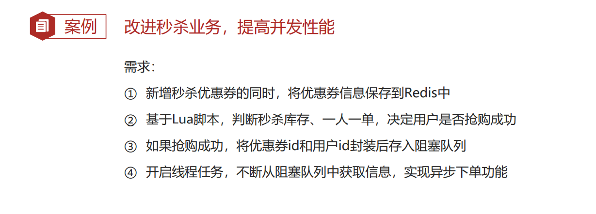


# TODO:


